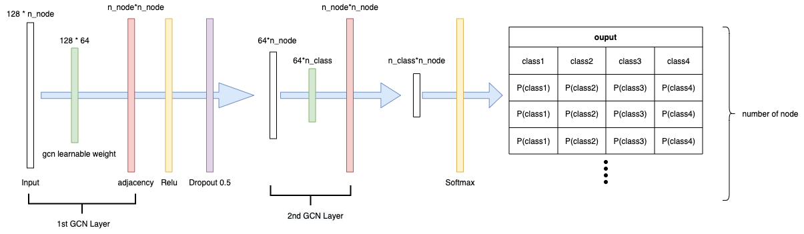
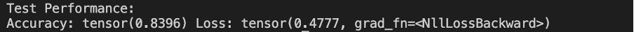

# Graph Convolutional Model for Facebook page Classifier

This GCN model is a multiple Graph Convolutional Layer model. The classifier aims to embed the node features and classify the node into different classes. In this project, the model is also expected to have a good performance in semi-supervised condition.

## Data 
[Facebook Large Page-Page Network]( https://snap.stanford.edu/data/facebook-large-page-page-network.html) is a graph data which presents the connection between each Facebook pages. Each page contains features which extracted from the site description, and the features will be the main information learned by GCN model. This graph data was collected by Facebook official API. There are 22,470 pages are labelled to four categories and connected by 171,002 edges in the data set. The edges between page to page are undirected so the edges can be considered as simple connection. 
In the original dataset, each node has different number of features. Because of the different number of features, the data structures will be too difficult to be learned by GCN. Thus, this model will implement a data set which named ‘facebook.npz’. This data set has the same edges data, but the features of each node has already been embedding into 128-dimension vector. The features space will be implemented into the model and make the model able to do the classification.

## Algorithm 
Graph Convolutional Network is a method to let a node to learn the features from its neighbourhood. 

```python
D*A*W*X
```
X the features space for all the nodes, and features will be multiplied with learnable weight, W. Thus, every feature will get a linear transform by the weight.  Then, all the nodes will sum the features from its neighbourhood through adjacency matrix, A. After the nodes get all the information form neighbours. Before the features space go to next iteration, all the nodes will multiply a normalise matrix by D. Node features will be divided by the number of nodes which connected to it. Therefore, the features of the nodes will be normalised to the next iteration.

## Network Structure
This model is created by two GCN layer. The main structure can be easily described as following diagram.


The first GCN Layer explained the process detailly. The input feature matrix is a 128 * number of node dimension matrix. After the feature multiply with a learnable weighting matrix, the features space will be embeded to 64-dimension space. The new embedding features will multiply with an adjacency matrix which contains the normalise parts, and the output will go through a Relu activation function. Before going into the second GCN layer, there is Drop out function to set the value be empty as 0.5 probability. The second layer has the same structure as the first one, however, the embedding space is compressed into number of classes. After the model embed the features into a dimension which is the same as the number of classes, the Softmax function can transform the final representation into probability. The probability can help us to classify which class is the most possible one for that node.

## Dependencies and Usage
The OS system should be Window and Linux. The import library is:
```python
import random
import math
import torch

import torch.nn as nn
import torch.nn.functional as F
import numpy as np
import scipy.sparse as sp
import torch.optim as optim
import seaborn as sns
import matplotlib.pyplot as plt

from torch.nn.parameter import Parameter
from torch.nn.modules.module import Module
from sklearn.manifold import TSNE
```

The script to run the model is:

```bash
python GCN.py
```

## Evaluation
In order to check the performance of this GCN model, the data set split into training set, validation set and testing set. The criterion for this classification is semi-supervised scenario, so the amount of training set and validation set needs to be 20% of the total data set. The epoch for the model training is 200. 
According to the following image, the accuracy increases rapidly after 40 epochs. The validation accuracy also keeps increasing to more than 0.8. 


The model will keep the best performance learnable weight, and the parameters can be implemented into model to predict the testing data set. The final testing accuracy will be printed after the training process done.



In the semi-supervised scenario, although 60% of the data is without labelled, GCN model still got more than 0.8 accuracy for the testing data. Its’ a reasonable accuracy comparing with the result from [Semi-Supervised Classification with Graph Convolutional Networks]( https://arxiv.org/abs/1609.02907). 

To demonstrate the performance of the GCN layer, TSNE is a good tool to show how the GCN separate the different class data in embedding space. 


 
According to the figure, the original features space can’t separate the class by boundary, and all the nodes in different class. However, GCN is a tool to learn how to separate the classes in the embedding space. After the first GCN layer, model got the new embedding space, and the embedding space can also be implemented in TSNE. 


 
The boundary of each class is more obvious than the original features space. In conclusion, GCN really can separate the node to classify the class in new embedding space.
