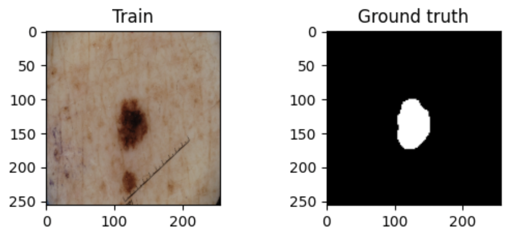
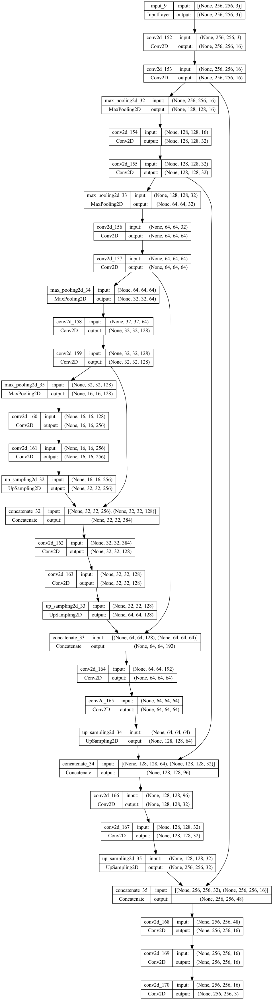
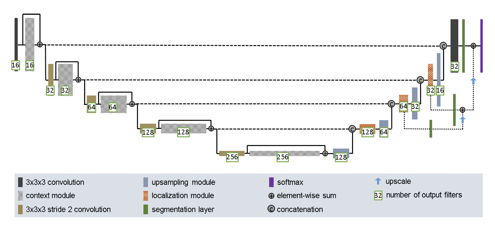

# Using an U-NET to segment the ISIC dataset


## Author
Name: Jingming Dai 

Student number: s4627234 / 46272346

This project was completed for COMP3710


## Description
This project uses Improved UNet to split the ISIC dataset with a minimum Dice similarity coefficient of 0.8 for all labels on the test set. 

In image segmentation tasks, especially medical image segmentation, U-Net is undoubtedly one of the most successful methods. U-net uses encoder (down-sampling) and decoder (up-sampling) structural connections. This project applies a technique that uses the Dice loss to train the model. Compared with the common U-Net, this model has better segmentation effect and higher dice similarity coefficient.


## Data set description:
The ISIC package includes four folders, including Training, Testing, Validation and their Ground Truth files. After downloading the files, we can put them into the newly created data folder. The directory of the files needs to be arranged as follows.

* data
    * data_ISIC
        * ISIC-2017_Training_Data
        * ISIC-2017_Training_Part1_GroundTruth
        * ISIC-2017_Test_v2_Data
        * ISIC-2017_Test_v2_Part1_GroundTruth
        * ISIC-2017_Validation_Data
        * ISIC-2017_Validation_Part1_GroundTruth




## How it works:

### UNet:
The structure of U-Net is shown in the following figure, the left part can be regarded as an encoder (down), and the right part can be regarded as a decoder (up).



The encoder has four submodules, each submodule contains two convolution layers, and each submodule is followed by a down-sampling layer implemented by MaxPool2D. The resolution of the input image is 256x256, and the resolutions of modules 1-5 are 256x256, 128x128, 64x64, 32x32, and 16x16, respectively. The encoder has two 3x3 un-padded convolutions and a 2x2 max pooling. 

The decoder consists of four sub-modules, and the resolution is sequentially increased by up-sampling operations until it is consistent with the resolution of the input image. The decoder uses two 3x3 un-padded convolutions and . After four up-sampling, a final 1x1 convolution with a sigmoid activation function is applied.


### Improved_UNet : 
The algorithm is a modified version of UNet created by Isensee and colleagues, and below is the improved UNet graph. The UNet() and UNet_imp() functions in modules.py build the UNet model before and after improvement. The model is built according to the following UNet architecture, but changing the output "softmax" to "sigmoid" at the end so the output is a mask of one channel.



#### Important parts of improved UNet:

All the convolution, context, element-wise-sum in encoding are integrated into the up_imp() function.

Part of upsampling, concatenate, and localization in decoding are integrated into the down_imp() function.

context module:
Described by 2 convolution layers (all except the first one with stride 2) with a dropout layer (0.3) in between.

Upsampling module: 
It consists of an upsampling layer and a convolution layer.

localization module: 
Completed by a 3x3 convolution and a 1x1 convolution.

Instance normalization and Leaky reLU are used throughout the architecture. The model is compiled with dice coefficient loss and dice coefficient.


## Install: 
``` 
git clone https://github.com/shakes76/PatternFlow.git 
```


## Using: 
!!! Before running it, you must set path_data to the path of the data folder in the dataset.py folder.

When using this data for the first time, you need to use dataset.load_dataset(data_reshape = True), this setting will convert all non-uniform data pattern sizes into 256*256 size patterns and save them in a new folder "data_Reshape" in the "data" folder ". The data format is as follows:

* data_Reshaped
    * Train
    * Train_GT
    * Test
    * Test_GT
    * Val
    * Val_GT

!!! Always remember to use (data_reshape = False) if reshaped data already exists

run predict.py to run the model

## Testing: 


## Conclusion:


## Packages:
os, cv2, skimage, tensorflow-macos_version_2.9.2

Name: SimpleITK_version_2.2.0
-- SimpleITK is a simplified interface to the Insight Toolkit (ITK) for image registration and segmentation
(http://simpleitk.org/)

Name: numpy_version_1.23.1
-- NumPy is the fundamental package for array computing with Python.
(https://www.numpy.org)

Name: pandas_version_1.4.4
-- Powerful data structures for data analysis, time series, and statistics
(https://pandas.pydata.org)

Name: matplotlib_version_3.5.2
-- Python plotting package
(https://matplotlib.org)


## Reference

Isensee, F., Kickingereder, P., Wick, W., Bendszus, M., &amp; Maier-Hein, K. H. (2018, February 28). Brain tumor segmentation and radiomics survival prediction: Contribution to the brats 2017 challenge. arXiv.org. Retrieved October 19, 2022, from https://arxiv.org/abs/1802.10508v1 


use load_dataset(data_reshape = True) for first time of using this data
always remember to remove data_reshape = True if there already exist the reshaped data

change path_data to the correct folder path