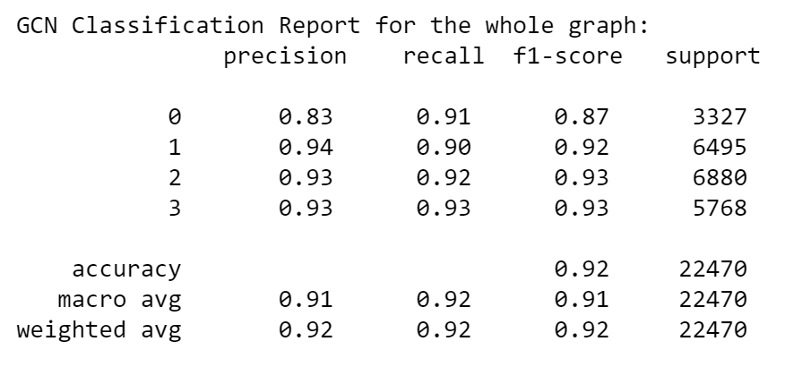
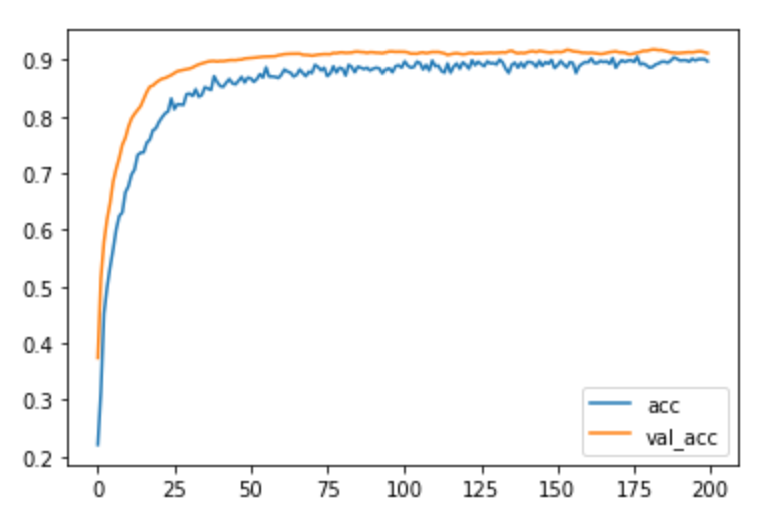
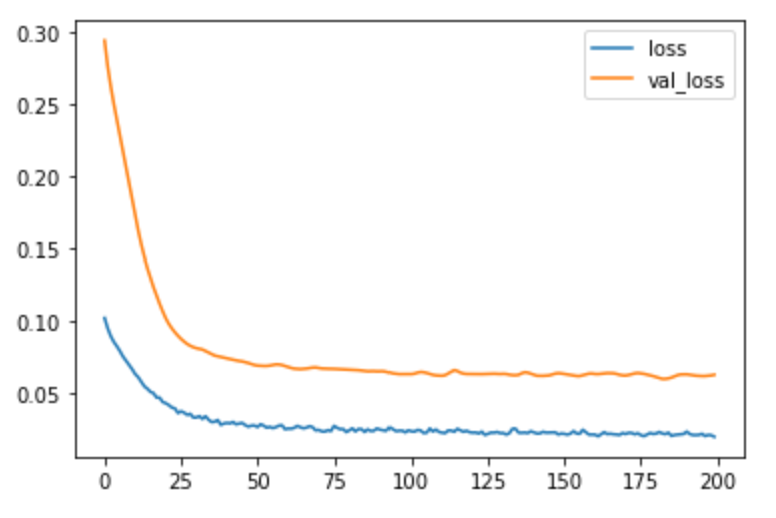
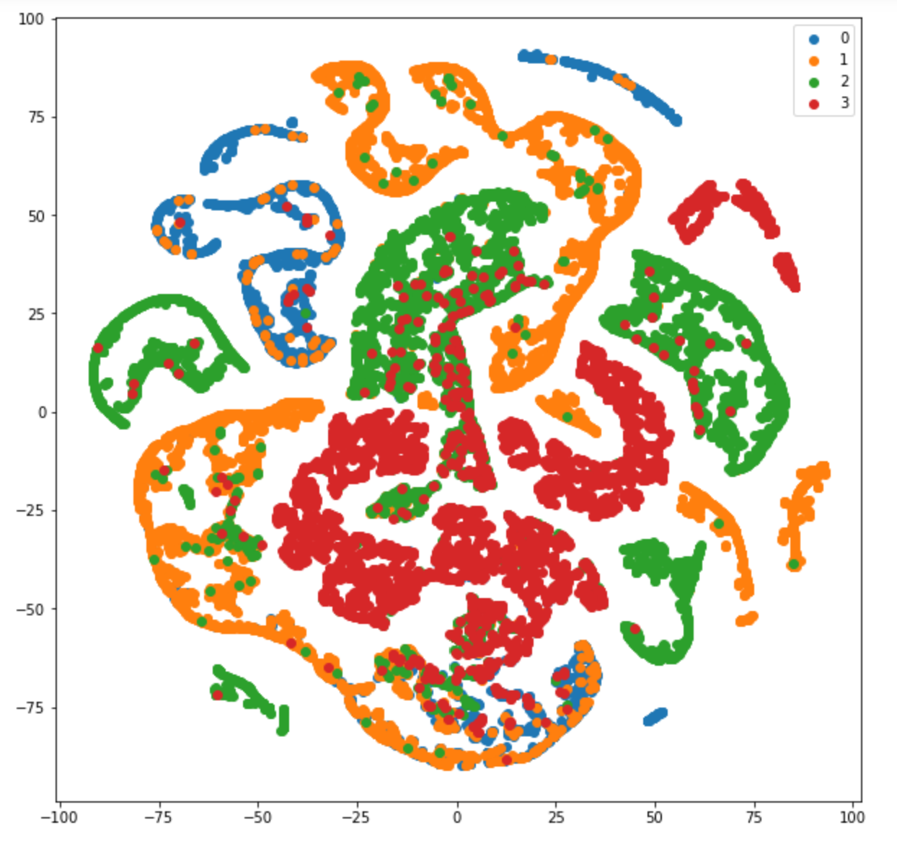

# Semi-supervised multi-layer GCN node classification model for Facebook Large Page-Page Network dataset

A semi-supervised multi-layer GCN model is built to classify nodes in Facebook Large Page-Page Network dataset. The algorithm firstly computes the self-loop adjacency matrix from the edges in the dataset, and then normalise it by D^{\frac{1}{2}}AD^{\frac{1}{2}}, where D is the degree matrix. The model has 3 GCN layers. It takes the normalised adjacency matrix and the features as inputs and classsify the nodes. The total accuracy of the model is 0.92.

## Facebook Large Page-Page Network dataset

This webgraph is a page-page graph of verified Facebook sites. Nodes represent official Facebook pages while the links are mutual likes between sites. Node features are extracted from the site descriptions that the page owners created to summarize the purpose of the site.

Nodes: 22,470

Edges: 171,002

Features: 128

Classes: 4

## Data pre-processing

The dataset contains edges, features and target.
1. Compute the self-loop adjacency matrix from edges
2. Normalise the self-loop adjacency matrix by D^{\frac{1}{2}}AD^{\frac{1}{2}}, where D is the degree matrix.
3. Split the dataset into training, validation and test sets, and set the mask for each set. The training set has 400 samples for each class, thus 1,600 samples in total. The validation set has 4,000 samples and the test set has 15,870.
4. Convert the target with one-hot

## Graph Convolutional Network

The GCN takes inputs of normalised adjacency matrix (A) and node features (X), and compute new features X' = AXW, where W is the weight matrix. X' is the new node features with the same number of rows (nodes) as X, but the dimension of features is changed to the channels of GCN layer. In a multi-layer GCN model, the last GCN layer has the same channels as the number of classes in the dataset, and thus predict the classes of nodes, as shown in the below figure.

## Results

Having trained the present model to 200 epochs, an accuracy of 0.92 was achieved as shown in Figure 1.

*Figure 1: Classification Report.*

*Figure 2: Training accuracy vs. validation accuracy curve.*

*Figure 3: Training loss vs. validation loss curve.*

Figure 4 shows the node classification by the model and the ground truth in colours.

*Figure 4: TSNE embeddings plot of the results.*

## Dependencies
Module:
- Python 3.7.0
- TensorFlow 2.5.0

Driver Script
- NumPy 1.20.3
- Pandas 1.3.2
- scikit-learn 0.24.2
- matplotlib 3.3.2

## References

Esmaeili, Mohammad & Nosratinia, Aria. (2020). Semi-Supervised Node Classification by Graph Convolutional Networks and Extracted Side Information. Retrieved from: https://arxiv.org/abs/2009.13734.