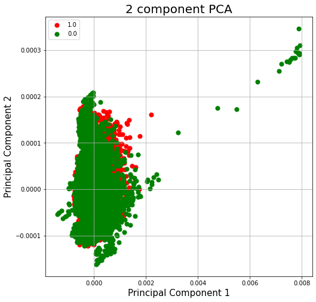

Requirements
1. The readme file should contain a title, a description of the algorithm and the problem that it solves
(approximately a paragraph), how it works in a paragraph and a figure/visualisation.
2. It should also list any dependencies required, including versions and address reproduciblility of results,
if applicable.
3. provide example inputs, outputs and plots of your algorithm
4. The read me file should be properly formatted using GitHub markdown
5. Describe any specific pre-processing you have used with references if any. Justify your training, validation
and testing splits of the data.

# Siamese Networks for Alzheimer's Disease Classification Using MRI Images

## Description and Problem

## How the Algorithm Works

## Results
Unfortunately, as of the current version, this implementation has failed to construct a suitable classifier.

All attempts at training a Binary Classifier using my Siamese Model to generate embeddings led to the Classifier getting stuck at a 51% accuracy (the ratio of negative to positive samples).

I tried many different model structures, as well as tweaked various hyperparameters, but was not able to get the Siamese Model to generate satisfactory embeddings with which to classify with.

This leads to the Binary Classifier quickly getting stuck in a local minimum, unable to differentiate between the classes just by the embeddings.

Running principal component analysis revealed that the issue was with the siamese model. Taking the two principal components with the highest variance and plotting them for each embedding resulted in the following scatter plot:

As can be seen, jsut considering the two components with the highest variance, there is a major overlap between the two classes. Thus, it is no wonder that the binary classifier was unable to assess the data sufficiently.

I attempted many different tweaks to my Siamese Model in order to try to improve the embeddings.

Techniques attempted include:
* Trying various batch sizes in range (32, 128)
* Trying various epochs num in range (30, 100)
* Changing structure of model - size of convolutions, number of convolutions, strides, max padding
* Changing the margin in the loss function in the range (0.1, 0.5)

If more time were available, I would try to train the Siamese Model using various other loss functions instead, for example Triplet Loss.

## Running the Code
### Dependencies
Requires Python version 3.9 or above (for type hinting)
Requires tensorflow version 2.8.2 or above
Requires numpy version 1.21.3 or above

### Dataset and Pre-processing
Original dataset sourced from: [ADNI dataset for Alzheimer's disease](http://adni.loni.usc.edu/)
Pre-processed dataset (used in this project) available from: [UQ Blackboard](https://cloudstor.aarnet.edu.au/plus/s/L6bbssKhUoUdTSI)

### Example Usage
