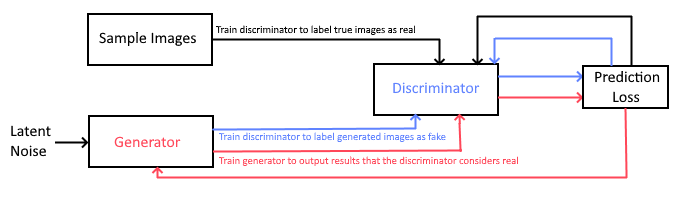
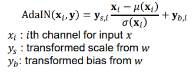
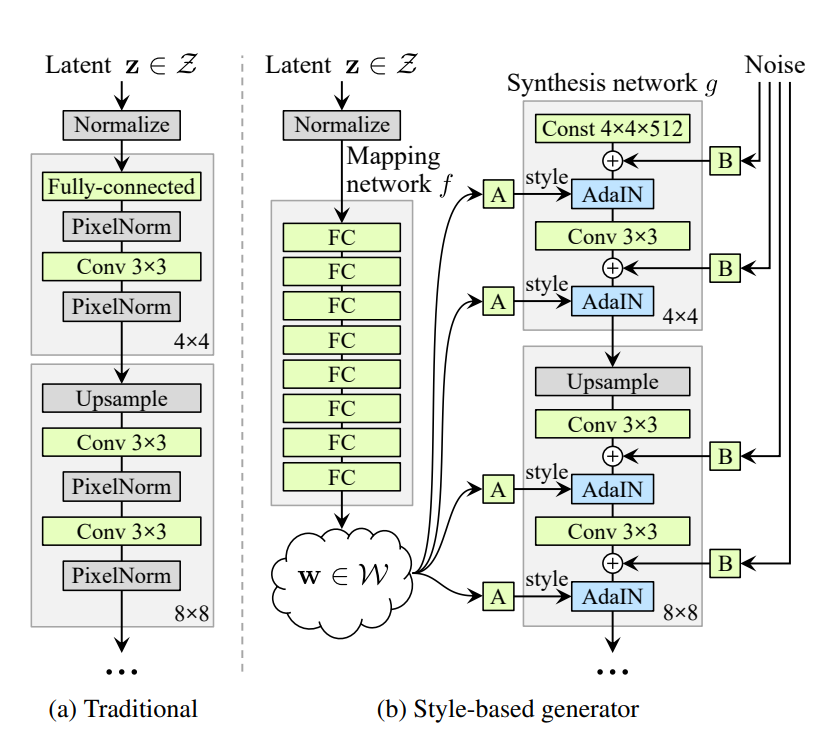
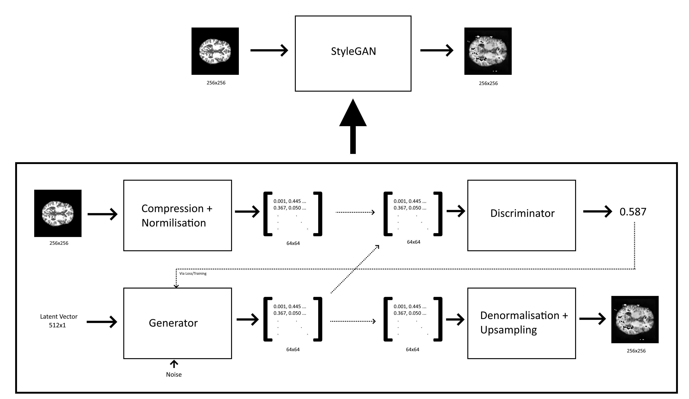
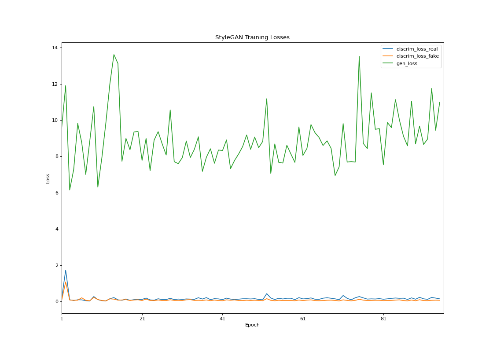
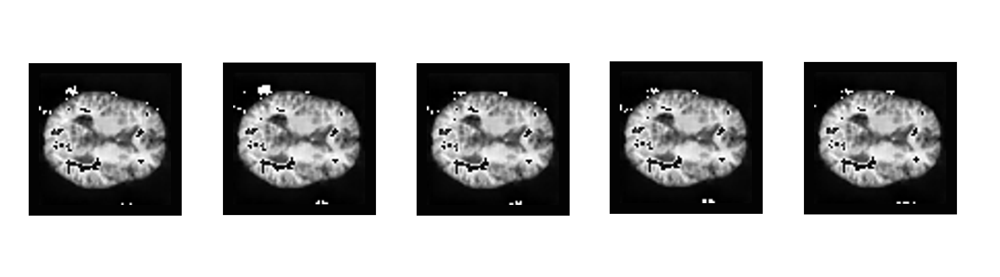

# StyleGAN for OASIS dataset

## Author
Jack Napier (46413569)

## Overview
---
### **Background**
#### Generative Adversarial Networks:
Generative Adversarial Networks (GAN's) are an approach to generative neural networks that conduct unsupervised learning by employing a secondary discriminatory network to evaluate the plausibility of the generator's outputs.
A GAN is typically comprised of a generator G, which takes in a latent vector z and returns generated information G(z), and a discriminator D, which takes in either a real sample X or a generated sample G(z) and returns whether the input is a real sample or not. In this way, loss is calculated for the generator G by composing it with D and taking the loss of the *inverse* of the output of D(G(z)). That is, a higher loss is computed the less real the discriminator determines G(z). As D is trained to evaluate only true samples as real, by backpropagating this loss calculated from D(G) through only the weights of G, G is trained to output data that closely mimics the original sample data. [1]


We thus set up the GAN in the following configuration:
<div align="center">
    
</div>

The GAN training paradigm is as follows: [1]

- Take a batch of real samples and train the discriminator to report a high "realness" score when it sees such an image.
- Generate a batch of fake images using the generator and its current set of weights. Train the discriminator to report a low "realness" score upon seeing such images.
- Train the generator to produce images that make the discriminator (now with newly trained weights) output a high "realness" score. The generator’s weights must adapt as the discriminator has just been trained on its current configuration.


#### StyleGAN:
GANs are currently considered one of the most powerful generational network techniques. However, the classical approach involves a generator G that takes a latent vector z and outputs a generated sample G(z). This can lead to issues because the generator synthesises features from these latent vectors, and the distribution of latent vectors may not relate to the distribution of features in the sample images. This can lead to synthesising invalid or non-existent feature combinations, feature combinations missing in the latent space, and/or a necessarily overcomplicated mapping from the latent space to output samples. [2]

StyleGAN attempts to combat this issue in the context of image generation with a revolutionary new generator architecture. In styleGAN the input latent vector z is first processed through a feature selection network f such that the distribution of w = f(z) closely relates to the distribution of features in the sample images. The generator then utilises a synthesis network g, which starts with a stack of constant values (an image per channel) that are convolved and upscaled to eventually form an image, with w informing the scaling and biasing at each resolution through the process of Adaptive Instance Normalization (AdaIN) given by the following: [2]
<div align="center">
    
</div>
With this construction, the vector w of features (which is distributed desirably) directly informs the selection of features, from the most macroscopic while the resolution is low, to more fine details as the image approaches its target resolution. Noise is also introduced at each stage of generation to control the finest details, such as freckles on faces. [2]

The difference between a traditional GAN generator and a styleGAN generator is illustrated below (Image Sourced from [2]):

<div align="center">
       
</div>

 
An additional benefit of this generator architecture, is that multiple mapping networks can be set up, giving various w's associated with different training sets. These w can be distributed to different layers of the synthesis network, essentially giving the output image the macroscopic features of one training set, mixed with finer features from other training set(s) [2]. This blending of styles is where the styleGAN gets its name. However, this particular feature was not required to solve the task at hand.

 

### **Implementation**
A styleGAN was implemented to generate images of the OASIS dataset of brain scans. As the styleGAN solves a generative problem, there was no train/test/validate split of the sample set. 


The project was undertaken with the convenient training environment (local machine with RTX2070) having access 8GB of VRAM. As such, to produce the best training results the sample dataset was heavily pre-processed in `dataset.py` before being input to the model. The original sample images were 256x256 RGBA images. However, these images were for intents and purposes greyscale, and possessed a significant monochrome border around the image focus (the brain). Thus, in order to minimise the amount of redundant information the styleGAN had to learn, the images were flattened to single channel greyscale and the border was then cropped out. This process was simple to programmatically invert on generator outputs to produce images that matched the format of the samples. Furthermore, the sample images were quite simple, composed primarily of macroscopic features/regions. As the number of weights required to learn increases exponentially with image size, the images were compressed to 64x64 before training. Generator outputs were later up-sampled back to the original image size. This learnable information reduction allowed the training to comfortably run with a satisfactory latent dimension and batch size on the available training environment. As mentioned, the sample images were composed primarily of macroscopic features, so the image compression was not significant enough to cause the styleGAN to fail to learn sample image features.

The images were then converted into 2D arrays of pixel intensities (in the range [0,255]). This data was then condensed to the range [0,1], and the mean of the dataset was taken and subtracted to centre the data around 0. This Normalisation does mean that the centring mean needs to be kept track of by the model through training in order to produce an image from the generator output. However, it was found that if this was not done training would collapse as the discriminator would quickly become easily able to distinguish between generated and real images with 0 loss. This is likely due to adaIN normalising the input data before scaling and biasing, resulting in the synthesis network being oriented towards producing normalised data. [2]


The styleGAN was implemented from scratch, with the discriminator and generator architecture defined in the `styleGAN` class included in `modules.py` following the above generator architecture and using a standard convolutional discriminator. A composed model is also defined allowing training of the generator as discussed above. Keras layers were used to define the architecture, with two custom layers defined by subclassing the Layer class to conduct learnt scaling weight noise addition and the adaIn procedure. Many architecture refinements were made over the course of the project as more techniques were learnt to provide stable training. One of the more significant changes was beginning the synthesis network with a constant tensor of 1's rather than 0's. It was found that training would consistently collapse at a certain epoch (the exact number depending on learning rates), but once this constant tensor was changed the generator consistently recovered from a loss spike at the same point. Training was found to consistently continue stably beyond this spike. It is theorised that this phenomena occurred due to 0's nullifying the effect of the initial few adaIN feature scaling passes, leading to a lack of the most macroscopic features (those being the most important to pass as a real image). This would allow the discriminator to easily distinguish between real and generated images with 0 loss after sufficient training, leading to training collapse. Learning rates were also refined experimentally. It was found that when learning rates were too high the generator's training diverged, and if the rates were too low then the discriminator was unable to provide sufficient feedback to advance training. Both cases result in noise. Furthermore, it was found that if the discriminator's learning rate was not sufficiently below that of the generator's, the discriminator eventually learnt to discriminate between real and generated samples with 0 loss and training collapsed.   

The final learning rates, which provided stable training, were:
- Generator: 0.00025
- Discriminator: 0.0002

The styleGAN training paradigm was custom written and defined in `train.py`. The training procedure followed was as described for GAN's above. Initially the discriminator was designed to conduct binary classification of images (real labelled as 1, fake labelled as 0) using `binary_cross_entropy` as a loss function. This allowed compilation of the keras models and the use of the existing `train_on_batch` function to conduct the 3 training stages via "supervised" training with generated labels. However, training performance was poor and resultant images failed to capture even the outlining shape of the desired brains. It was found that this method of discrimination was insufficient and the current standard for styleGAN is to use `soft_plus` as a loss function [3]. `soft_plus` is effectively a smooth ReLU fucntion, and thus constrains the output of the discriminator to positive, with negative outputs instead approaching an asymptote of 0 loss. 

In order to implement this, keras `GradientTape`s were learnt in order to manually implement the three training rounds described earlier, using `soft_plus` to compute the loss of each discriminator prediction. When training the generator to recognize true samples as real, (and thus also when training the generator to fool the discriminator using the composed model) the negative of the output of the discriminator was fed into `soft_plus`, which hence returned a loss closer to zero the higher the 'realness' score granted. When training the discriminator to recognize generated images as fake, the output of the discriminator was fed directly into the `soft_plus`, resulting in a higher loss the higher the 'realness' score granted. This approach increased the 'distance' between real and fake images in the eyes of the discriminator. Having the discriminator output a continuous value as opposed to a binary classification also provided more information to the generator. After implementing this loss function the styleGAN produced desirable results, as described in the results section below.

To summarise, we have broadly that the developed algorithm takes in sample images of brain scans from the OASIS dataset as inputs and outputs generated images that are distinct from the images in the dataset, but that could pass as brain scans originating from the OASIS set. This is achieved using:

- A data pre-processor/loader: that takes in images from the OASIS image samples, and returns normalised data representing the image cropped and compressed to 64x64 as output

- A discriminator: that takes in normalise compressed image data as input, and outputs a 'realness' score that describes how likely the input comes from an image in the OASIS dataset

- A generator: that takes in a latent vector and noise as input, to return normalised data representing a theoretical 64x64 image

- A process to undo image normalisation, that takes in normalised 64x64 data as input, and returns an upscaled padded 256x256 image of a brain scan from the OASIS dataset as output


<div align="center">
    
</div>

## Dependencies
---
Python version: 3.10.4

In addition to the standard Python libraries, the following software packages are required:
|    Package   |  Version |                                        Installation                                       |
|:------------:|:--------:|:-----------------------------------------------------------------------------------------:|
| `Numpy`      | 1.22.3   | `pip install numpy`                                                                       |
| `TensorFlow` | 2.9.2    | `pip install tensorflow`
| `Pillow` | 9.1.0    | `pip install Pillow`                                                                  |
| `Matplotlib` | 3.5.1    | `pip install matplotlib`                                                                  |
| `CUDA`       | 11.2     | [Installation Guide](https://docs.nvidia.com/cuda/index.html#installation-guides)         |
| `CUDNN`      | 8.4.1    | [Installation Guide](https://docs.nvidia.com/deeplearning/cudnn/install-guide/index.html) |


Note this project is no-longer being actively maintained.

## Requirements
---
Training the styleGAN in its current configuration has the following hardware requirements:
|        |                 Required                | Development Environment |
|--------|:---------------------------------------:|:-----------------------:|
| Memory | 10GB RAM                                | 32GB DDR4 RAM           | 
| GPU    | CUDA/CUDNN Compatible GPU With 8GB VRAM | NVIDIA RTX 2070 8GB     | 
|        |                                         |                         | 

The VRAM requirement can be reduced by reducing the resolution of the compressed images (Achieved by lowering the `COMPRESSION_SIZE` constant in the train method), However the GPU used must still be CUDA and CUDNN compatible.

## Results
---
Training the styleGAN did not produce a smooth convergence in loss, as is standard for GANs.
The generator's loss was consistently higher than that of the discriminator and oscillated but never diverged, with the discriminator's loss also oscillated, but to a much lesser degree. 
The loss during training is plotted below:

<div align="center">
    
</div>

The training loss indicates that the styleGAN suffered from mode collapse during training [4]. This is supported below, as all generated sample images from the trained network are of the same brain scan. Due to the simplicity and high similarity between all images in the training set, this was the probable outcome. It is likely that the mapping network was overfit to the limited number of features present in the sample images. Due to time constraints and the inherent instability of training it was decided that these results were satisfactory. The generated images do share high similarity with the complete sample set as discussed, and these generated images satisfy the given objective of "reasonably clear image". If more time and resources were available, the latent dimension of the network would be expanded, and the sample data would be augmented to counter the mode collapse, in addition to further refinements to the architecture of both generator and discriminator. Another potential solution would be to terminate training after the initial ~20 epoch training period described below, before mode collapse sets in. However, the resultant images would contain a significant amount of noise which does not align with the "reasonably clear" objective discussed prior.


The training initially involved the styleGAN determining the macroscopic features, primarily the brain's shape and fill. This occurred for roughly 20 epochs as indicated by the higher amplitude oscillations in the generator's loss. From here the training fell into a cycle as described by the mode collapse above. The generator would work out the fine features (the patterns on the brain slice), reducing the amount of noise in the image as it did so. Once the brain had gotten to a certain point, the discriminator would catch on to the specific pattern and the generator would switch back to a noisy image containing just the macroscopic features and begin refining again, working on a new set of fine features. Samples were captured per epoch and a selection of these samples are presented below to illustrate:
<div align="center">
    
</div>
Interestingly there are recurrent cases where the generator only sends the background to black in certain patches (the synthesis network begins with a constant tensors of 1's which represents white). This highlights cases where the discriminator only investigates certain regions to check if a 'correct background' is present and seems to indicate the areas that are checked.

The complete training process is visualised below:
<div align="center">
    
</div>


In this way, obtaining the clearest result was a matter of running training until an epoch produced images with a suitably low amount of noise. It was found that 95 epochs of training produced model weights which provided satisfactory results. This took roughly 10 hours of training on the available training environment.

Some samples from this trained model are provided below:

<div align="center">
    
</div>
As discussed above the samples are all a single brain slice, however they satisfy the objective as "reasonably clear generated images of the OASIS dataset"

These results are highly reproduceable, training has been found to be stable for a prolonged time period and followed the same cycle each trial. However, it should be noted that the exact number of epochs to produce reasonably noise free results is subject to variance. 

A pretrained model with the weights that produced the above samples is included inside the `model` folder and can be used to generate more samples using the `generate_images` function included in `predict.py`.


## Usage
---
The individual helper functions included are documented in their respective files.

 To train a styleGAN for the OASIS dataset, one should run the `train` function included in `train.py`. The `train` function takes 3 arguments:
 - `model`: the folder containing the StyleGAN
 - `image_source`: the folder containing the training images
 - `epochs`: the number of epochs to train for

 If you wish to initialise and train a new styleGAN model from scratch, pass in `model = None`. This will generate a new styleGAN, which will be saved in the working directory inside the `model` folder. This new styleGAN will be configured to train on images compressed to 64x64, with a latent dimension of 512 and using a synthesis network that begins with 4x4 resolution. If you wish to initialise a styleGAN with alternate parameters, you can modify the `COMPRESSION_SIZE`, `LATENT_DIM`, and `GENERATOR_INIT_SIZE` constants provided at the beginning of the function. Note that `COMPRESSION_SIZE` will also need to be set appropriately if training on a pre-existing model with an alternate output size and a training image cache has not been built yet.

 Upon first running `train`, an image cache is constructed containing the normalised numerical data of the compressed images. This cache will be used as the training set while it exists in the working directory.

 Upon completion of the requested training epochs, a plot is generated of the training losses. Training appends history to a `history.csv` in the working directly so consecutive runs of `train` will generate plots containing the information from previous training sessions.
 If one wishes to plot a specific range of training epochs, one can run the `plot_history` function located in `GANUtils.py` directly, passing in the desired epoch range as the final argument.
 
 The generated training history plot is displayed in its own window and saved to the working directory as `training_loss.png`

 After each epoch, a sample of 5 generated images is saved to the `output` folder in the working directory. If one wishes to modify the number of samples taken per epoch, one can modify the `IMAGE_SAMPLE_COUNT` constant located at the beginning of the `train` function.

 If one wishes to configure a different default location for these working components, one can modify the `TRAINING_HISTORY_FILE`, `IMAGE_SAMPLE_FOLDER`, `DEFAULT_MODEL_LOC` and `HISTORY_PLOT_FILE` constants included in the `train` function.

Training is configured to run with a batch size of 16, as this was the maximum achievable with the VRAM available (8GB). In order to configure this yourself, modify the `BATCH_SIZE` constant located at the top of the `train` function.

This will result in two plots being displayed, one at 10 epochs, the other containing the full 20. The latter will be saved to disk and the `output/` folder will contain 20 sets of samples.


To generate images from a trained styleGAN, one should run the ` generate_images` function provided in `predict.py`
The `generate_images` function takes 3 arguments:
 - `model_folder`: the folder containing the StyleGAN from which to generate the sample images
 - `num_images`: the number of images to generate
 - `save_folder`: the folder to save the generated images

 If `save_folder = None` is passed, the images are not saved to disk, but they are still generated and rendered in their own window to the user.
### Examples:
```python
from train import train
from predict import generate_images

#Generate new styleGAN and train for 10 epochs
train( 
    model = None, 
    image_source = "images/", 
    epochs = 10
    )

#train the styleGAN for a further 10 epochs (20 total)
train( 
    model = "model/", 
    image_source = "images/", 
    epochs = 10
    )

#Generate and display 5 sample images from the trained model
generate_images(
    model_folder = "model/"
    num_images = 5
    save_folder = None
    )

#Generate and display 5 more samples, saving to "samples"
generate_images(
    model_folder = "model/"
    num_images = 5
    save_folder = "samples/"
    )
```
## References
---

- [1] Ian J. Goodfellow, Jean Pouget-Abadie, Mehdi Mirza, Bing Xu, David Warde-Farley, Sherjil Ozair, Aaron Courville, Yoshua Bengio, “Generative Adversarial Nets,” arXiv:1406.2661 [cs, stat], Jun. 2014, arXiv:1406.2661. [Online]. Available: https://arxiv.org/abs/1406.2661

- [2] T. Karras, S. Laine, and T. Aila, “A Style-Based Generator Architecture for Generative Adversarial
Networks,” arXiv:1812.04948 [cs, stat], Mar. 2019, arXiv: 1812.04948. [Online]. Available: http://arxiv.org/abs/1812.04948

- [3] NVIDIA Corporation, "StyleGAN3." Oct. 2021, [Online]. Availible: https://github.com/NVlabs/stylegan3/blob/main/training/loss.py

- [4] Brownlee, J., "How to Identify and Diagnose GAN Failure Modes." Jul. 2019, [Online] Machine Learning Mastery. Available at: https://machinelearningmastery.com/practical-guide-to-gan-failure-modes/


