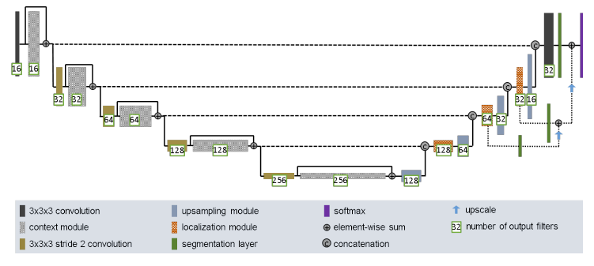
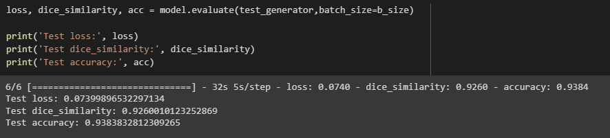
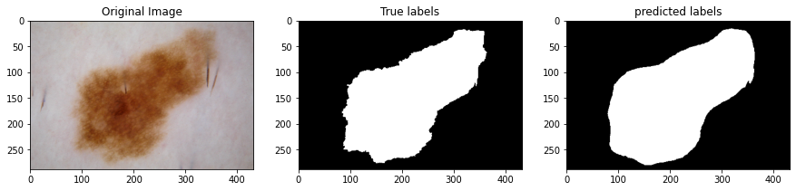
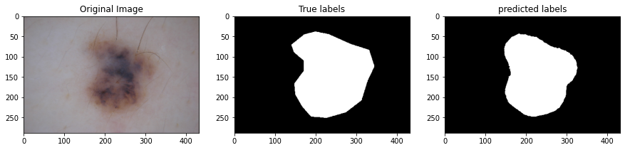
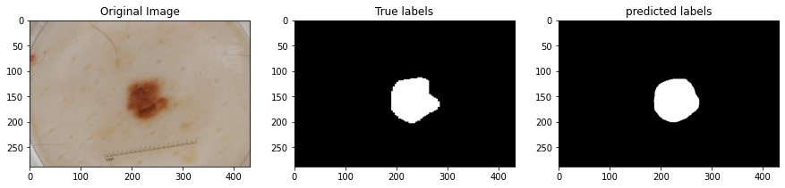
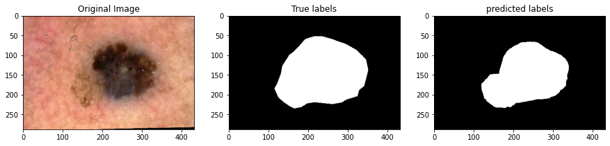
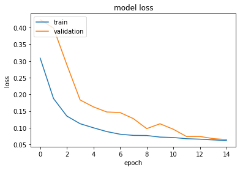
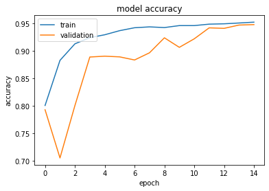
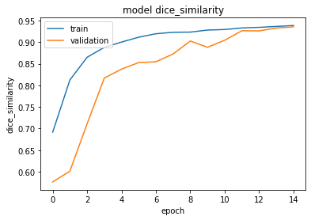

# Improved U-Net applied to the 2017 International Skin Imaging Collaboration (ISIC) Dataset with Segmentation

## Why use U-Net on ISIC?
The ISIC is an annual challenge that serves as a part of an international effort to use computer vision to improve melanoma diagnosis based on images of skin legions. 
A U-Net is a type of convolutional neural network that has been specifically developed for biomedical image segmentation, and is a collection of modifications made to a fully convolutional network with the intention of improving segmentation accuracy on smaller training sets.
By utilizing an improved U-Net algorithm, this project works to identify regions of a given image in which there is significant discolouration, based on training with images and corresponding segmentation mask images, to analyse each pixel of an image to determine whether or not the area is a different colour to the natural skin, identifying potential melanomas.

## How an Improved U-Net works
An Improved U-Net works in 8 main sections, each comprised of two convolutional layers. These 8 sections are split into two parts - condensing and upsampling. The condensing part has 4 of these two part layers, where in the data goes through the standard convolutional layers, but at the end of each 'part' (or, every two layers), a snapshot of the state of the network layer is taken and stored for later use. Then, the network goes through 4 corresponding 'upsampling' layers, which replace the standard pooling layers by instead upscaling the previous layer and concatenating with the appropriate 'snapshot' from the convolutional layers. 
I have followed the concepts and principals as explained the paper [Brain Tumor Segmentation and Radiomics Survival Prediction: Contribution to the BRATS 2017 Challenge](https://arxiv.org/pdf/1802.10508v1.pdf). This paper also provides this diagram, which provides a clearer visualization of how these layers interact. 



I have also taken inspiration and advice from [This Kaggel U-Net implementation](https://www.kaggle.com/code/mukulkr/camvid-segmentation-using-unet/notebook) which segments an images into 32 different possible categories.  

## Results
The U-Net I have implemented has been very successful, getting these sound results on a test set after only 15 epochs:



Which can be visualised:







I have also created a plot of loss, Accuracy, and Dice Similarity (for more details on this metric, please read the paper above).





## Reproducibility 
These results were attained by running the code on google colab, with random seed set to 909, and all packages at their most current version as at 20/10/22. Note that due to computing and time constraints, it was run using only the 'training' set from the ISIC data, and was downloaded and split with the following code:
```
dataset_url = "https://isic-challenge-data.s3.amazonaws.com/2017/ISIC-2017_Training_Data.zip"
maskset_url = "https://isic-challenge-data.s3.amazonaws.com/2017/ISIC-2017_Training_Part1_GroundTruth.zip"
data_dir = keras.utils.get_file(origin=dataset_url, extract=True)
mask_dir = keras.utils.get_file(origin=maskset_url, extract=True)

im_root = "/root/.keras/datasets/ISIC-2017_Training_Data"
lb_root = "/root/.keras/datasets/ISIC-2017_Training_Part1_GroundTruth"
data = Path(im_root)
mask = Path(lb_root)

base_imgs = list((data).glob("*.jpg"))

train_imgs, val_imgs, test_imgs = np.split(base_imgs, [int(len(base_imgs)*0.7), int(len(base_imgs)*0.9)])

train_pair = make_pair(train_imgs, mask)
test_pair = make_pair(test_imgs, mask)
val_pair = make_pair(val_imgs, mask)
```

The split of 7:2:1 was chosen in accordance with the standard split, though the testing set is somewhat smaller than standard to ensure there was sufficient data for training on the smaller set. 
