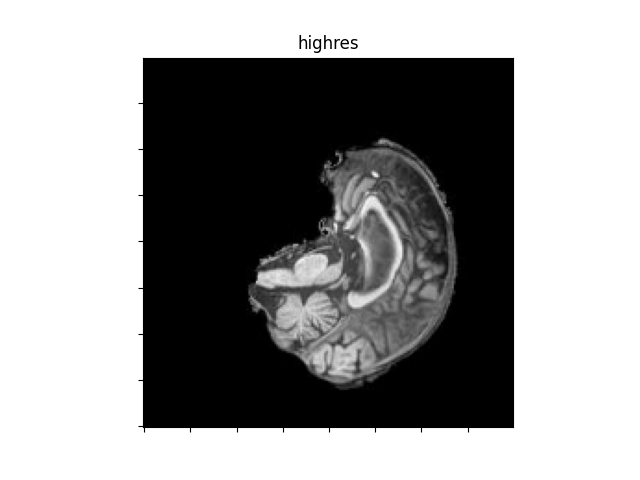
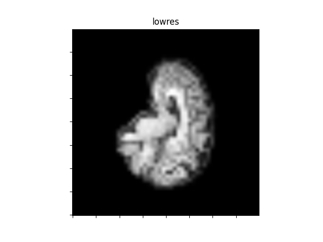
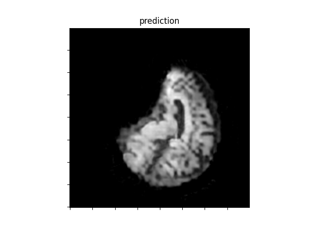

# MRI Super-Resolution Network on the ADNI Brain Dataset
***
This model takes upscaled (approximately by 4x) images from the ADNI Brain Dataset and downscales them.
***

***

How to use:
- Add dataset images to new folder named "datasets"
- run train.py
- run predict.py

***
References:

https://keras.io/examples/vision/super_resolution_sub_pixel/
https://medium.com/@zhuocen93/an-overview-of-espcn-an-efficient-sub-pixel-convolutional-neural-network-b76d0a6c875e
