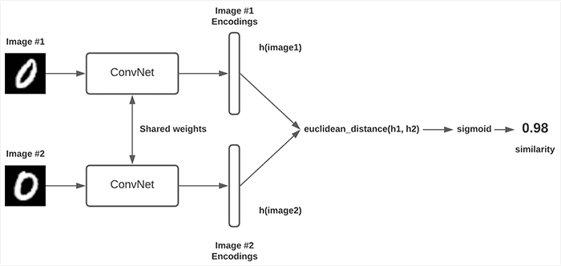
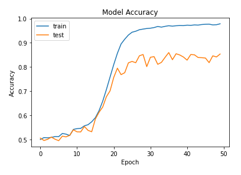
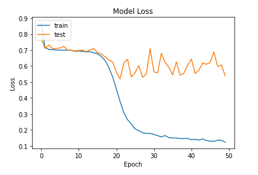
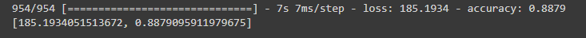
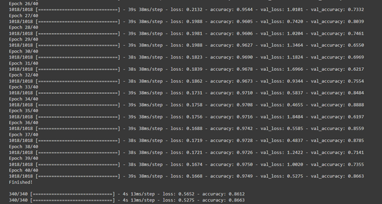

# A Classifier based on a Siamese Network for Classifying Alzheimer's on the ADNI Dataset

Name: Matthew Shearer

Student Number: 46422833

This project aims to implement a classifier based on a Siamese Network architecture to classify Alzheimer's disease in the ADNI dataset.

## Dataset

The ADNI data that has been preprocessed by the COMP3710 was used, however, the data was pooled together and training, testing and validation splits were made using 60/20/20 proportions. The `dataset.py` file expects the ADNI data to be given in a folder in the same directory as the file in the following structure:

- ADNI_AD_NC_2D
  - AD_NC
    - test
      - AD
        - *.png
      - NC
        - *.png
    - train
      - AD
        - *.png
      - NC
        - *.png

## General Introduction to Siamese Architectures

Siamese Neural Networks (SNN) work by having a pair of Convolutional Neural Networks (CNNs) that share the same weights, with a pair of images being fed into each of the CNNs (i.e, there are two CNNs, each receiving an image that makes up a pair). Each CNN, which is sometimes referred to as the embedding model or embedding layer, then produces a vector and a distance computation is made on each of the CNNs vectors. The result of this computation is fed into a final sigmoid layer, which classifies whether the pair of images is similar or not. A general layout of an SNN can be seen below:



## The Classifier based on a Siamese Network (the algorithm and the problem it solves)

As already explained, an SNN is a pair of CNNs with shared weights, with each CNN creating an embedding given some image. Extending this a little further, we can use the trained Siamese network's embedding CNN to classify individual images, since the CNN is essentially being trained to create an embedding for each class that will be dissimilar to another class, and so in a way it can be used for classification. Clearly, the problem this implementation is trying to solve is the detection of Alzheimer's in brain scans.

## Usage

The `train.py` file does not require any commandline arguments and can be called as long as the dataset is in the correct directory structure (which is necessary for the `dataset.py` file). The only requirement for `predict.py` is that a model name 'Classifier_Model' is given in the same directory that the file is in. Both `dataset.py` and `modules.py` do not need to be called in order for `train.py` to work. Following from the task sheet, `train.py` will train a model based on the architecture in `modules.py`, and will produce training and validation accuracy and loss plots, with a testing accuracy. A classifier will then be created using the embedded network in the SNN to classify images. Both the SNN and this classifier will be saved (with the classifier being the more important model).

The `predict.py` will take a file path from the directory `predict.py` is in as an argument in the command line (which expects 'AD' and 'NC' child directories similar to the data structure shown above) and then use the classifier model in the same directory to make predictions on the data (which is produced from `train.py`), with the final accuracy being printed out. As an example, I run predict.py on the command line as:

```
py predict.py ADNI_AD_NC_2D/AD_NC/test/
```

## Results

Although several attempts and different architectures were created, the most successful one achieved a test accuracy of 86.12% for the SNN while the classifier achieved an accuracy over the entire dataset of 88.79%. The architecture that achieved this is given in the `modules.py` file. The training and validation accuracies and losses can be seen below.




Evidently, although it trained for 40 epochs, the architecture seems to reach around a 80% accuracy on the validation within 20 epochs, and doesn't increase much higher than that. We can also see that the validation loss doesn't really decrease after 22 epochs, and the model is clearly overfitting after ~22 epochs. Using the embedding layer from this architecture, the classification model achieved a 88.79% accuracy on the entire dataset. Although this is a very impressive result, I think the training accuracies and loss's are very inconsistent, but do tend to hang around the 60%-80% range. A screenshot of the classifier's accuracy output can be seen below:



In addition to this, I've provided an example of the training output (note that there is not really an example input):



I'd also like to quickly mention (which is also slightly touched on in the reproducability section) that these results fluctuate quite a bit. I'm not certain why the model's loss and accuracy vary so significantly, but over the several runs I've done with this architecture, the model will very regularly achieve a high training, validation and testing accuracies, with a classifier accuracy ranging from ~71% to ~88%.

## Dependencies

This project has the following dependencies:
* Python 3.9.0
* tensorflow 2.9.1
* Pillow 9.2.0
* numpy 1.23.3
* scikit-learn 1.1.2
* matplotlib 3.5.2
* os
* random

## Note on Hardware

I should note that the code (and the results above) come from me executing this code in a google colab environment. I've tried running this code a number of different ways, but I find that there can be memory issues (but its hard to tell if it's just my machine, since I have very little free memory). Hence, if you attempt to run `train.py` but encounter memory issues, I highly encourage you to try training in google colab (specifically, I trained by copying all the code into the google colab session and removing imports between files, i.e, the code was all in a single cell). Alternatively, I think you can decrease the batch size (which is quite high since I was, again, running in google colab) and increase epochs to try and get the same results but without having spatially-complex matrices during each iteration (and hence avoiding the memory issue), but I have not tried this. 

In any case, as long as the machine this code runs on does not encounter the OOM issue, the `train.py` file should work fine.

## Note on Reproducability

It should be noted that reproducing the results above might be a little difficult, since the data is randomly split, and so you each run might take less (or more) epochs to reach the ~80% validation accuracy. However, from repeated runs, I've found that it will almost always reach ~80% accuracy with 25-40 epochs, and the results should be reproducable.

## References
[1] https://keras.io/examples/vision/siamese_contrastive/ 

[2] https://www.cs.cmu.edu/~rsalakhu/papers/oneshot1.pdf
