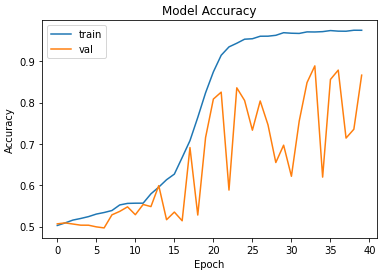
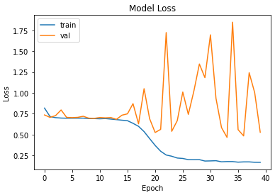

# A Siamese Network for Classifying Alzheimer's on the ADNI Dataset

This project aims to implement a classifier based on a Siamese Network architecture to classify Alzheimer's disease in the ADNI dataset.

## Dataset

The ADNI data that has been preprocessed by the COMP3710 was used, however, the data was pooled together and training, testing and validation splits were made using 60/20/20 proportions. The `dataset.py` file expects the ADNI data to be given in a folder in the same directory as the file in the following structure:

- ADNI_AD_NC_2D
  - AD_NC
    - test
      - AD
        - *.png
      - NC
        - *.png
    - train
      - AD
        - *.png
      - NC
        - *.png

## General Introduction to Siamese Architectures

Siamese Neural Networks (SNN) work by having a pair of CNNs that share the same weights, with a pair of images being fed into each of the CNNs (i.e, there are two CNNs, each receiving an image that makes up a pair). Each CNN, which is sometimes referred to as the embedding model or embedding layer, then produces a vector and a distance computation is made on each of the CNNs vectors. The result of this computation is fed into a final sigmoid layer, which classifies whether the pair of images is similar or not. A general layout of a CNN can be seen below:

## The Classifier based on a Siamese Network (the algorithm and the problem it solves)

As a brief introduction, a Siamese network is a pair of Convolutional Neural Networks that share the same weights, and each producing a vector. Each network in the Siamese network is fed an image simultaneously, and from this image, each network will produce a single vector. With these vectors, which are sometimes also referred to as embeddings, a distance metric can be computed between them (such as L1 distance in my case), which can be used to determine the similarity between the images according to the Siamese network. Finally, the distance between the embeddings can be fed into a final sigmoidal function, which classifies whether the pairs of images belong to the same or different classes. We can then use this architecture to make predictions on whether a pair of images belong to the same class (i.e, are similar) or belong to separate classes (i.e, are dissimilar). We can then use the trained Siamese network's embedding CNN to classify individual images. Clearly, the problem this implementation is trying to solve is the detection of Alzheimer's in brain scans.

## Usage

The given files are intended to be used as is. It does not require any arguments, and `train.py` can be called as long as the dataset is in the correct directory structure. The only requirement for `predict.py` is that a model name 'Classifier_Model' is given in the same directory that the file is in. Both `dataset.py` and `modules.py` do not need to be called in order for `train.py` to work.

## Results

Although several attempts and different architectures were created, the most successful one achieved a test accuracy of 83.51%, and the architecture that achieved this is given in the `modules.py` file. The training and validation accuracies and losses can be seen below.

Evidently, although it trained for 50 epochs, the architecture seems to reach around a 80% accuracy on the validation (note that it has been written as test here, sorry for the confusion) within 25 epochs, and doesn't increase much higher than that. We can also see that the validation loss doesn't really decrease after 22 epochs, and the model is clearly overfitting after ~25 epochs. 

## Dependencies

This project has the following dependencies:
* Python 3.9.0
* tensorflow 2.9.1
* Pillow 9.2.0
* numpy 1.23.3
* scikit-learn 1.1.2
* matplotlib 3.5.2
* os
* random

## References
[1] https://keras.io/examples/vision/siamese_contrastive/ 

[2] https://www.cs.cmu.edu/~rsalakhu/papers/oneshot1.pdf
