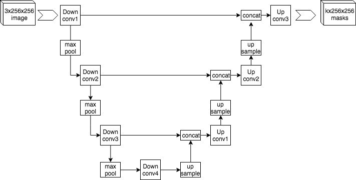
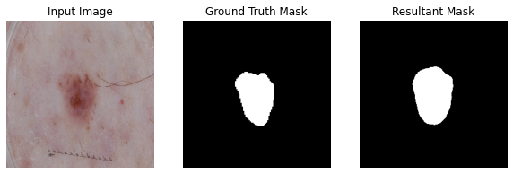
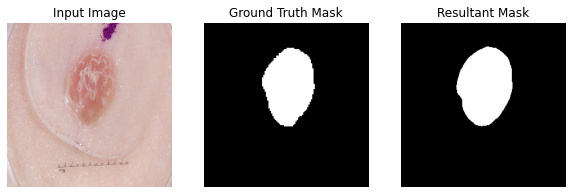
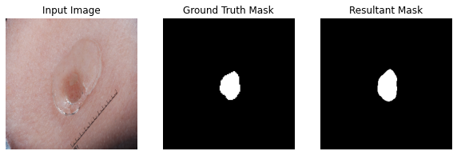

# Image Segmentation on ISIC Dataset using Improved U-NET Model

## What is a UNET

The UNET, as developed by Ronneberger O, Fischer P and Brox T in 2015, is a fully convolutional neural network intended specifically for biomedical image segmentation (such as our task). This model learns not to label images, but to take images and label individual pixels within the image, providing as output a "mask", which, overlayed on the original image, allows us to locate features within that image which we have trained the model for.

## How does it work

The U-Net is composed of two near symmetrical parts. The encoder and the decoder. The encoder reduces the resolution of the image, while increasing the density of the feature map, learning more and more complex relationships between features. Whereas the decoder reconstructs the image from the features learnt, with skip connections in between as the model has already learnt the feature mappings of the image in the enconder, and this can be used by the decoder.

## Results
!! The model was developed in google collab, a notebook to run it in is the recommended method and has been provided !!

Average dice coefficient for the test set is: Dice 0.7014097571372986

---

---

### Dependencies:

    Python 3.7.13
    Keras 2.4.3
    Tensorflow 2.3.0
    Matplotlib 3.5.2

### Splits
We ended up using a training/Testing/Validation split of 70/15/15. This seemed to work best. (Other splits considered were 80/10/10, 70/20/10, but provided worse results)

-- Preprocessing was limited to normalizing the data

