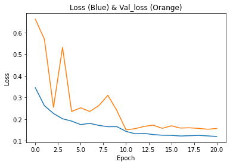
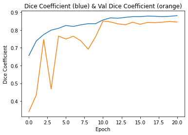
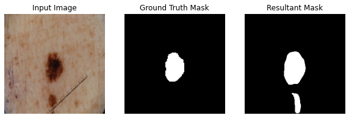
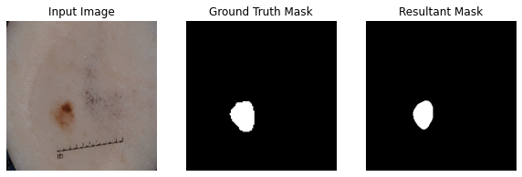

#- contain a title
- a description of the algorithm and the problem that it solves (approximately a paragraph)
- how it works in a paragraph
- a figure/visualisation
#- list any dependencies required, including versions
- provide example inputs, outputs and plots of your algorithm
- Describe any specific pre-processing you have used with references
- Justify your training, validation and testing splits of the data

# Image Segmentation on ISIC Dataset using Improved U-NET Model
---

## What is a UNET
---

## How does it work
---

## Results
---

---

Epoch 25: val_loss improved from 0.20673 to 0.19117, saving model to model-tgs-salt.h5
100/100 [==============================] - 86s 865ms/step - loss: 0.1362 - accuracy: 0.9483 - diceCoefficient: 0.8638 - val_loss: 0.1912 - val_accuracy: 0.9457 - val_diceCoefficient: 0.8088 - lr: 1.0000e-04
Epoch 26/30

### Dependencies:

    Python 3.7.13
    Keras 2.4.3
    Tensorflow 2.3.0
    Matplotlib 3.5.2