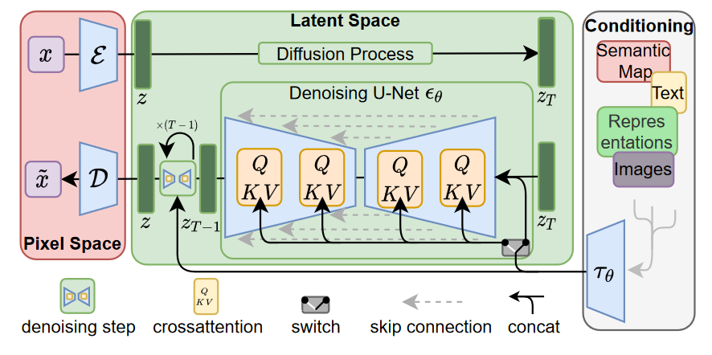
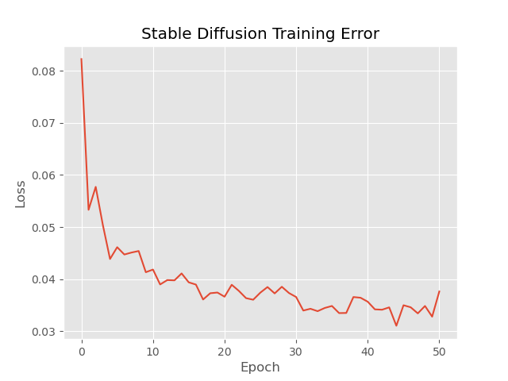
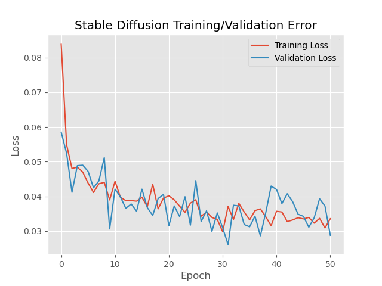
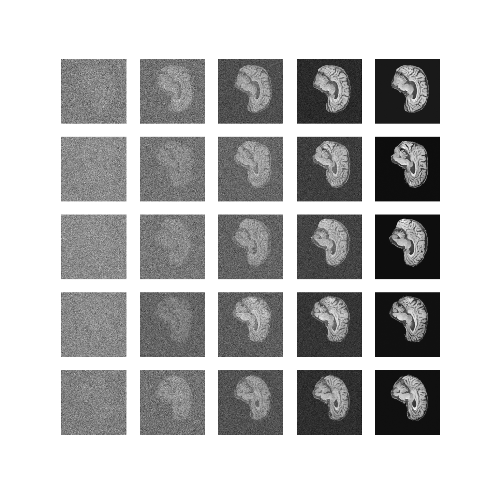
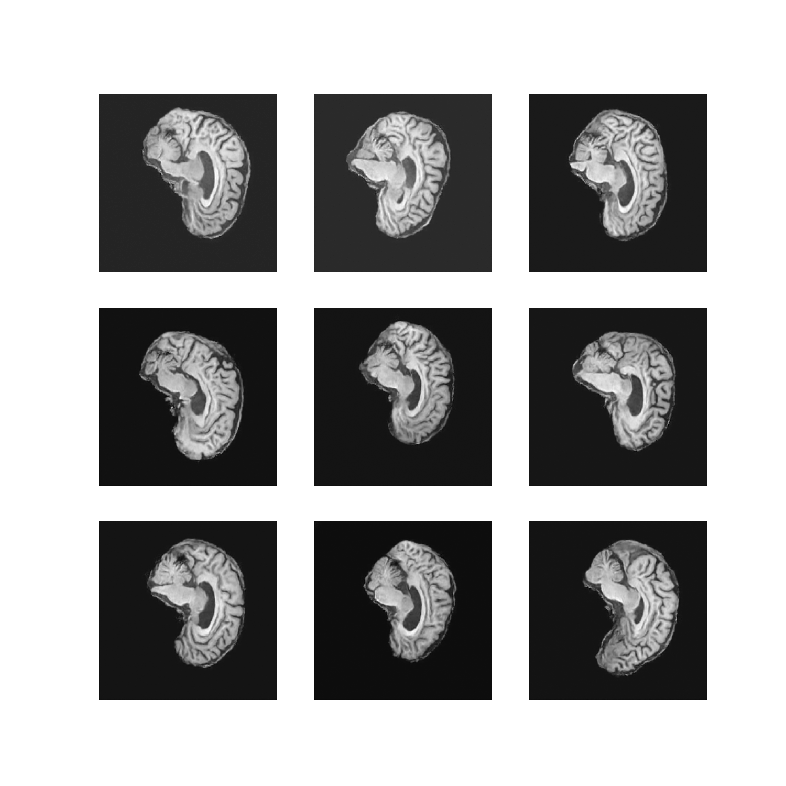

# Stable Diffusion on the ADNI dataset

## Design Layout

`imports.py` contains the basic imports requried throughout our implementation.

`dataset.py` contains the data loader for loading and preprocessing the ADNI dataset.

`modules.py` contains the implementation of the stable diffusion model.

`train.py` contains the code for training, validating, testing and saving of the model.

`predict.py` contains example usage of the trained stable diffusion model.

## Data Loading and Preprocessing

To handle data loading, we use `torch.utils.data.DataLoader` and `torch.utils.data.Dataset`. 
`Dataset` allows for the storage of our image data, while `Dataloader` wraps an iterable around the pre-defined `Dataset`, allowing simplified access to our image data such as when training our model.
In terms of preprocessing, we apply the transformation `torchvision.transforms.ToTensor()` within our `Dataset`, which converts a `PIL` Image with shape (HxWxC) in the range [0,255] to a  `torch.FloatTensor` with shape (CxHxW) and range [0,1]. This portion of our data loading implementation can be found within `dataset.py`.

Before passing our (batches of) image data into our model, one final set of transformations is applied. These are taken from `torchvision.transforms`, and include: `Grayscale` (ensures the images only have one colour channel), `Resize` (ensure all images have same size), `CenterCrop`, and a linear scaling into [-1,1] via an applying `Lambda(lambda t: (t * 2) - 1)`.

Since our aim is to generate a number of images via our Stable Diffusion model, and given that our dataset is split into brain MRI images with and without Alzheimer's disease, we chose to simply combine both partitions to increase the number of training images available. Since we do not implement a "Test" module, as described in "Validation" below, our validation dataset includes a small percentage of the "test" images within the ADNI dataset.

## Model Details

Our model of choice is an implementation of the Stable Diffusion, as proposed in the paper https://arxiv.org/abs/2112.10752, and as shown visually below.



Stable Diffusion is based on Latent Diffusion, in which the network is trained to "denoise" random Gaussian noise. In Latent Diffusion, instead of working in pixel space, our (UNet) model is trained to generate latent representations of given images -- and after training, we can use this same model, and a "denoising" process, to recieve images visually similar to those in which the model was trained with.

It is important to note that our implementation does not include "conditioning", as well as "crossattention", as depicted in the above diagram. Since our aim is to reproduce images of a singly type (i.e. in our case, images of a segmented brain), we concluded that the addition of "conditioning" and "crossattention" was not required.

Hence, our implementation is more aligned with the "original" latent diffusion paper https://arxiv.org/abs/2006.11239 (which likewise does not implement "conditioning" or "crossattention"), as reference in the Stable Diffusion paper.

## Training

Throughout training, we implemented F1 loss via `torch.nn.functional.l1_loss`.
Shown below is the generated loss curve, training for 50 epochs total.




## Validation

Validation was performed throughout the training process in `train.py`. In particular, since our model/network is not a 'clasiffier' network, we cannot simply count the numbre of correct 'guesses' that our model predicts. Instead, we can simply take the `get_loss` function used to train the model, and on another (seperate) dataset (i.e. one that the model has not been trained on), apply the `get_loss` function here and return the validation loss, which can then be plotted alongside the training loss as shown below.



Note that it doesn't follow with our model type to have 'Test' functionality, on top of our 'Train' and 'Validate' functionality, again since our model is not a classification network.


## Usage

We can use `predict.py` to visualise the backwards diffusion process via
```python
model = torch.load("DiffusionModel")
reverse_diffusion(model, plot="plot_diffusion_process")
```
as shown below.



We can use `predict.py` to visualise a number of final denoised images, via the backwards diffusion process, via
```python
model = torch.load("DiffusionModel")
reverse_diffusion(model, plot="image_grid")
```
as shown below.



We can also use `predict.py` to visualise the backwards diffusion process, on a single sample, via the generation of a `.gif` through
```python
model = torch.load("DiffusionModel")
reverse_diffusion(model, plot="image_gif")
```
as shown below.


## Dependencies

Note that pytorch, and dependent packages, were installed via `conda install pytorch torchvision torchaudio cudatoolkit=11.7.0 -c pytorch -c conda-forge`, as suggested via the home page of https://pytorch.org/.

The main dependencies include:
* `python=3.10.6`
* `pytorch==1.11.0`
* `torchvision=0.12.0`
* `cudatoolkit=11.7.0`
* `matplotlib=3.6.0`
* `pillow=9.2.0`
