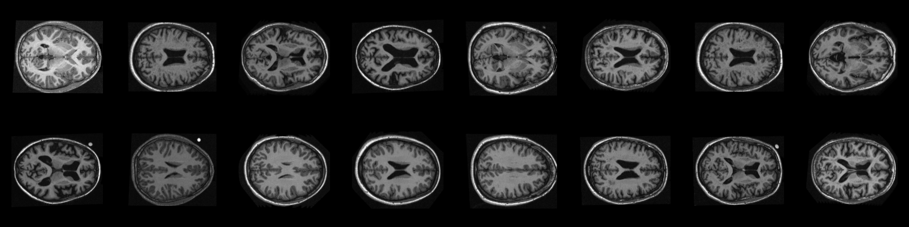
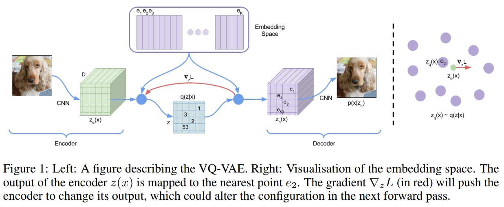
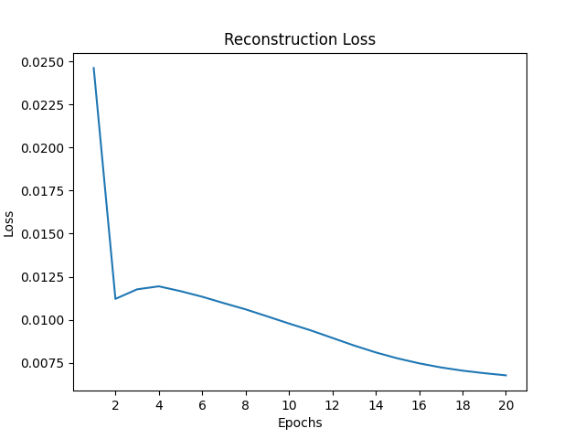
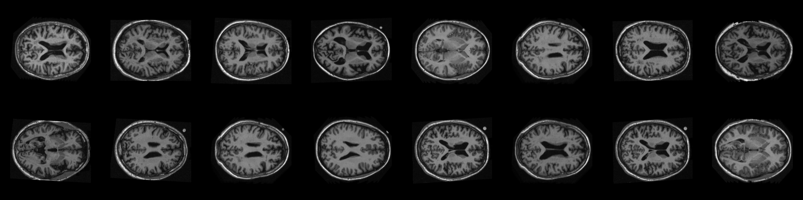
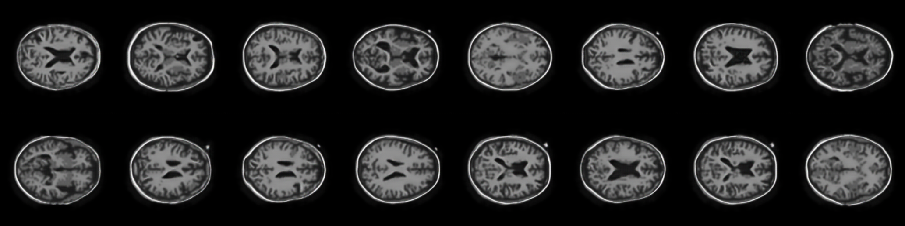
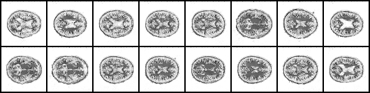

# Generative Model using VQ-VAE and DCGAN

Autoencoders are used to reconstruct images by creating an information bottleneck for the data. It is optimised to minimise the information loss during the training process. Variational Autoencoders (VAEs) build on this idea by tackling the problem of latent space irregularity. Moreover, Vector Quantised Variational Autoencoder (VQ-VAE) aims to solve the issue where powerful decoders tend to ignore the latent variables, this is done by adding the Vector Quantised (VQ) method. Further, VQ-VAE learns discrete latent representation, using VQ [[1]](#references), since many objects in the real-world are discrete.
 
A Generative Advesarial Network (GAN) is a generative model that involves two networks: the generator and discriminator which play a min-max game and are simultaneously trained by an adversarial process. The generator learns to generate new images that are similar to the training data and the discriminator learns to distinguish between the generated image and the real image [[2]](#references). Deep Convolutional Generative Adversarial Network (DCGAN) extend the standard GANs by using deep convolutional networks to have a stable architecture and improve the results [[3]](#references).
 
A DCGAN has been used to generate new images.

## The Dataset
The __[OASIS Brain dataset](https://cloudstor.aarnet.edu.au/plus/s/tByzSZzvvVh0hZA/download)__ has been used for this task which consists of 256x256 MR images of the brain. Note that the brain segamentation images have been omitted for this task. The images are split into train, validation and test sets, with 9,664 images belonging to the train set, 554 to the test set and the rest to the validation set. The validation set is not used in this implementation. Visualising a sample of the data:

## Data Pre-processing 
The pixel values of the images were normalised to be between [-1.0, 1.0].

## VQ-VAE Architecture
As mentioned earlier, the encoder network outputs discrete codes instead of continuous. This is done by maintaining a discrete codebook which is constructed by calculating the distance between continuous embeddings and the encoded outputs. The decoder then generates the reconstructed samples from the discrete codebook [[1]](#references). 
 

 
In the current implementation, the encoder network consists of two convolutional layers (with ReLU activations) and two ResNet blocks. Conversely, the decoder network contains two deconvolutional (conv transpose) layers (with tanh activation for the last layer) instead. After some experimenting it was found that initialising the weights, using Glorot initialisation with uniform distribution, of the convolutional layers showed better results.

## DCGAN Architecture
The discriminator is made up of strided convolution layers with LeakyReLU activations and takes an image representation of the codebook indices as input and outputs a probability that the input is the real data. The generator is made up of deconvolutional layers with ReLU activations and takes as input a latent vector that is drawn from a standard normal distribution and outputs the generated image representation of the codebook indices.

## Results
The VQ-VAE model was trained for 20 epochs with the batch size of 32, and the DCGAN model was trained for 40 epochs with the same batch size, both using the Adam optimiser with learning rate 3e-4 and 2e-4 respectively. 

<table>
  <tr>
    <td></td>
    <td></td>
  </tr>
 </table>

The VQ-VAE model achieved a maximum Structed Similarity Index Measure (SSIM) of 0.8462. Note that it is the mean of the element wise SSIM. 

<table>
  <tr>
    <td>Real Images</td>
     <td>Reconstruced Images</td>
  </tr>
  <tr>
    <td></td>
    <td></td>
  </tr>
 </table>

The generated codebook indices from DCGAN model: 

The generated image:

<table>
  <tr>
    <td>Real Images</td>
     <td>Generated Images</td>
  </tr>
  <tr>
    <td></td>
    <td></td>
  </tr>
 </table>

The mean SSIM between the above images is 0.63. 

## Dependencies
* Python 3.7.15
* torch 1.12.1
* torchvision 0.13.1
* torchmetrics 0.10.0
* matplotlib 3.2.2
* numpy 1.21.6
* os
* pickle

## Predict.py

To test the model, change the path of the dataset in `dataset.py` to where the data is stored and simply run `predict.py`. The hyperparameters can be changed in `train.py`.
 
**Note:** The images are in their respective folders but they need to be put into other folders of their own for `torchvision.datasets.ImageFolder`. An example of directory structure: Train_images/keras_png_slices_train. You can find out more on the directory structure for torchvision.datasets.ImageFolder __[here](https://pytorch.org/vision/stable/datasets.html)__.

## References
[1] A. v. d. Oord, O. Vinyals, and K. Kavukcuoglu, “Neural Discrete Representation Learning,” arXiv:1711.00937 [cs], May 2018, arXiv: 1711.00937. [Online]. Available: http://arxiv.org/abs/1711.00937
 
[2] Goodfellow, I.J. et al. (2014) Generative Adversarial Networks, arXiv.org. Available at: https://arxiv.org/abs/1406.2661. 
  
[3] Radford, A., Metz, L. and Chintala, S. (2016) Unsupervised representation learning with deep convolutional generative Adversarial Networks, arXiv.org. Available at: https://arxiv.org/abs/1511.06434. 