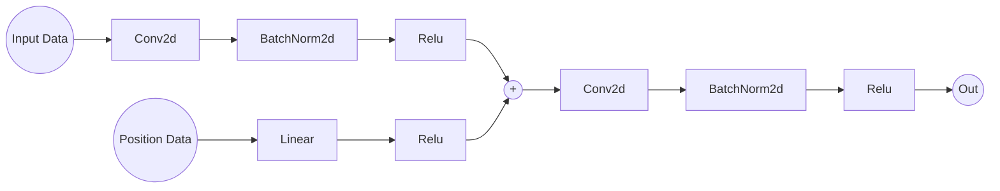
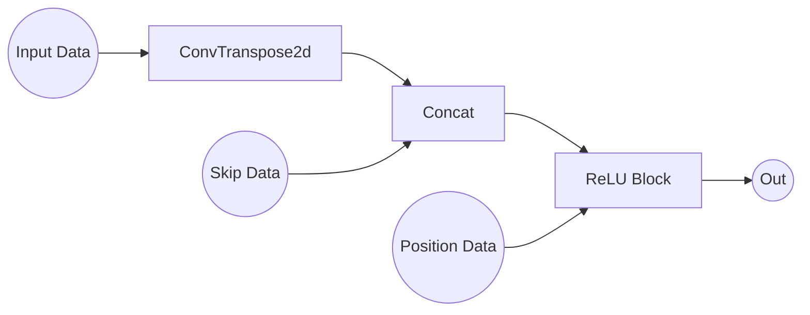
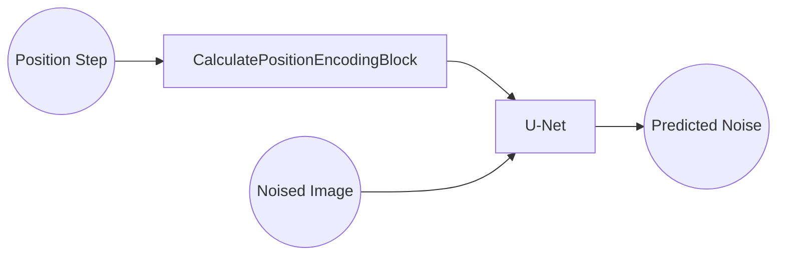

# Stable Diffusion of OAI OKOA MRI Knee Scans Dataset
#### Comp3710 Assignment - Logan De Groot - 46443762
## Overview
The diffusion model implemented is able to generate brand-new knee MRI scans that have never
been seen before based off pure noise as an input, with that noise being `256x256` randomly
generated tensor with values between `[0,1]`. The model implemented is a stable diffusion model.

Stable Diffusion works by taking a given dataset (in this case OAI OKOA MRI Knee Scans) and applying a known amount of noise
to an image from the dataset. The model then takes the newly noised image and attempts to determine how much noise
has been added to the image. This predicted noise can then be compared to the actual noise
for training and model improvement. This ideally produces a model that can accurately estimate
how much noise has been added to a specific image of the dataset.

Once the model has been trained random noise can be generated and inputted which the model just sees
as image from the dataset with noise applied. The model then generates a guess to how much noise needs to be removed
from each specific pixel to produce an image similar to the trained dataset. At this point via some math
as described in the basis [paper](https://arxiv.org/pdf/2006.11239.pdf) the input noise can have the predicted
noise removed to generate a brand new Knee MRI scan. 

This process can be illustrated with the below figure where going left to right
is applying noise and the model attempts to figure out how much noise has been applied to go from
right back to left. Then when generating an image you just start on the right-hand side 
via a randomly generated set of noise and ask the model to form an image based off previous
noising examples.


Reference https://developer.nvidia.com/blog/improving-diffusion-models-as-an-alternative-to-gans-part-2/

## File Design
The project has been split up into 4 distinct files primarily:
- diffusion_imports.py - wrapper file for all required imports used for code simplicity 
- dataset.py - primarily handles loading loading data and preprocessing
- modules.py - This is the main file that contains a modified U-NET model used
- train.py - This is the file that runs and enables the use of all other files #TOCHANGE
- predict.py - This file plots and shows visualisation from the saved model

## Data Loading
The OAI AKOA Knee MRI dataset is required for this model. When attempting to train the model,
a `torch.torch.utils.data.dataset` and `torch.utils.data.dataloader.DataLoader` must be used which can be found within 
`dataset.py`. For simplicity a convenient wrapper has been provided called `load_data` which when given a
path to the OAI AKOA Knee MRI dataset will return a `torch.utils.data.dataloader.DataLoader` to be used for training. To
instantiate:

```python
from dataset import *
dataloader = load_data("PathToDataSet")
```
where various options can be passed such as `batchsize` to control the number of images returned when using the 
dataloader (default 16), `workers` to control multiprocessing capabilities for loading images (default 12)
and `show` to produce a single image upon instantiation to confirm correct data and see a sample image (default false).

## Preprocessing
Upon commencement of training preprocessing of the dataset is required. Thankfully only two significant steps are taking when transforming the data into a usuable version.

The first step is to load the data in via `Pillow` which by default produces a `Pil Image` in RGB format. This is then converted to grayscale via `.convert("L)` and resized to 256x256. 
As the images are grayscale it makes sense to do this conversion as it reduces the future tensor dimension from `(3,h,w)` to `(1,h,w)` reducing training time 
and complexity without loss of information. The resize to 256,256 is to ensure all images have a consistent size reducing the chance of error and irregularities in training.

From here the second step is to convert the `Pil Image` to a `torch.Tensor` which can be done by `torchvision.transforms.transforms.ToTensor`. 
This has the added affect of scaling all data to be within the bounds of [0,1] instead of [0,255]. Finally the data must 
be normalised from [0,1] to [-1,1], this can easily be done by multiply by 2 and subtracting 1. This has to be done to 
ensure consistency with the reversing of predicted noise from the unet model.

In total, all of the preprocessing steps can be achieved with the following lines which can be found within the provided
`dataset.py` and is handled via the use of `load_data(Path)`:
```python
from diffusion_imports import *

trans = transforms.ToTensor()
slice = trans(Image.open("Path_To_Specific_Image").convert("L").resize((256, 256)))
slice = slice.mul(2).sub(1)
```

## Model
The implemented model is a modified UNET network which makes heavy use of Convolution Layers and Pooling. A U-NET is
used due to it's ability to down sample and then re-upscale giving it the ability to predict noise levels with some
modification. The structure of the U-NET is as follows:

Reference https://lmb.informatik.uni-freiburg.de/people/ronneber/u-net/

The above U-Net has been slightly modified to include the ability to add Positional Embeddings which let's the U-Net
learn/know the level of noise currently within the image being passed through the network. This is necessary
as the U-Net by default has no concept of how much noise has been added and without it makes predicting noise
nearly impossible.

In the modified U-Net model used there are four distinct blocks that are used. These are:
1. ConvRelu
2. UpBlock
3. CalculatePositionEncodingBlock
4. MainNetwork

### ConvRelu
The ConvRelu block is the core block of the modified U-Net. It's forward function takes `InputData` which is the current
`torch.Tensor` being worked with and `pos` which is the positional data from the `CalculatePositionEncodingBlock`. 
The forward function is described below in order:

This block is responsible for every level of the Network (i.e the conv,relu,conv,relu when downsampling and upsaling) and `MainNetwork` handling
the `MaxPool` and `UpBlock` handling the up-convs (see below details).

### UpBlock
The UpBlock is an extension of `ConvRelu` that implements an additional `torch.nn.modules.conv.ConvTranspose2d` with
`kernal_size=(2,2)` and `stride=(2,2)` and handles the upscaling within the U-NET. It also concatenates the the skip
layers as depicted in the above U-NET design. The forward function is depicted below and takes input data 
(the current tensor), position data (current position embedding) and skip (skip layer info from previous downsamples):

### CalculatePositionEncodingBlock
The calculate position encoding block, as the name implies, handles calculating a position encoding for a given position
from `[0,1000]` describing the level of noise in the image that has been applied. The code for this block has been
adapted from `https://huggingface.co/blog/annotated-diffusion` and calculates the position encoding via Sin and Cosine
concatenation. This is then passed through a `torch.nn.modules.linear.Linear` followed by 
`torch.nn.modules.activation.ReLU` before being returned.

### MainNetwork
The main network is where all of the above blocks are put together to form the modified U-NET. The modified U-NET
follows a very similar design to above. It starts with a input image with noise applied, a position step (measure of how 
much noise has been applied from [0,100])


## Training
The training pipeline has been written and can be found in `train.py`. It consists of three important parts:
1. Optimizer
2. Loss Function
3. Training Loop and Process

The optimizer chosen for the model was Adam (`torch.optim.adam.Adam`) which was originally proposed by the 
[paper](https://arxiv.org/pdf/2006.11239.pdf) due to it's ability to generalise to multiple problems and noisy datasets.

The Loss function selected was `l1_loss` (`torch.nn.functional`) as it calculates the absolute mean error between two 
tensors (image and noise) which is useful when trying to predict the average amount of noise in an image and provided
consistent results.

The training loop for this model is relatively straight forward and clean consisting of two for loops with the first
being the number of epochs with the second being a loop through a `DataSet` produced by `load_data`. Note that the training
dataset is 80% of the dataset which is approximately 14,800 images:
```python
from diffusion_imports import *

data_set = load_data("path to dataset")

model = MainNetwork()

optimizer = Adam(model.parameters(), lr=0.001)
criterion = F.l1_loss

for epoch in range(10):
    for index, data in enumerate(tqdm(data_set)):
```
From here a random pos is generated which signifies how much noise will be applied to the images contained within data
which is passed to the apply_noise function which returns a noisy image (image + noise) and just the noise without the
image. This is then passed to the model for it to predict how much noise was added to the noisy image.
```python
pos = torch.randint(0, 1000, [batchsize]).long()
data_noisy, noise = apply_noise(data, pos)
optimizer.zero_grad()
predicted_noise = model(data_noisy.cuda(), pos.cuda()).cuda()
```
This predicted noise is then passed to the above mentioned loss function with the actual noise which then calculates
the loss and improves the network:
```python
loss = criterion(predicted_noise, noise).cuda()
loss.backward()
running_loss += loss.item()
optimizer.step()
```
This cycle gets repeated for the specified number of epochs, the trained model used 50 epochs.

To train your own model do the following via terminal:
```console
python train.py
```
which defaults to 50 epochs or
```console
python train.py {number_epochs}
```

Something to note is that during a single epoch, each batch of images is only trained on 1 specific level of noise out 
of the possible 1000 levels of noise. This means that training and validation loss can swing widely depending on the images themselves and the amount of
noise added and can not be reconstructed without seeding.


## Validation
A validation set of 20% was seperated from the original dataset to ensure that the model was not over training or remembering the dataset. 
After every epoch the validation set was tested and the average loss recorded:


It is worth noting that loss for the training set varies significantly from epoch to epoch but in general is declining signifiying that the model is
learning the general features of the AKOA Dataset.

## Validation & Training Overlayed
The overlay of training and validation can be seen below:


## Visualization & Results
The stable diffusion model can be ran and utilised in `predict.py` to generate images, three functions have been provided
namely:
1. Generate Single Image - Generates and displays a single image

```console
python predict.py single
```
2. Generate N Image Process - Generates and displays n single image with the conversion process. 10 is the recommended number

```console
python predict.py illustrate {number_of_images}
```
3. Generate N Images - Generates N images and displays them in a canvas style. 10 is the recommended number

```console
python predict.py generate {number_of_images}
```

Please allow significant time to generate images depending on hardware. Below is a single image that has been generated. This took approximately 20 seconds.


Below is an example of function 2 showing 10 images and conversion process from noise into a knee scan


Below is 99 images that have been generated. This took approximately 30 minutes.


## Dependencies
The following dependencies are required to run the included model and training. All of these packages can be achieved via 
`<package installer> install pytorch torchvision torchaudio cudatoolkit=11.3 -c pytorch`:

- blas                      1.0                         mkl
- brotlipy                  0.7.0           py310h2bbff1b_1002
- bzip2                     1.0.8                he774522_0
- ca-certificates           2022.07.19           haa95532_0
- certifi                   2022.9.14       py310haa95532_0
- cffi                      1.15.1          py310h2bbff1b_0
- charset-normalizer        2.0.4              pyhd3eb1b0_0
- colorama                  0.4.5                    pypi_0    pypi
- contourpy                 1.0.5                    pypi_0    pypi
- cryptography              37.0.1          py310h21b164f_0
- cudatoolkit               11.3.1               h59b6b97_2
- cycler                    0.11.0                   pypi_0    pypi
- fonttools                 4.37.4                   pypi_0    pypi
- freetype                  2.10.4               hd328e21_0
- idna                      3.3                pyhd3eb1b0_0
- intel-openmp              2021.4.0          haa95532_3556
- jpeg                      9e                   h2bbff1b_0
- kiwisolver                1.4.4                    pypi_0    pypi
- lerc                      3.0                  hd77b12b_0
- libdeflate                1.8                  h2bbff1b_5
- libffi                    3.4.2                hd77b12b_4
- libpng                    1.6.37               h2a8f88b_0
- libtiff                   4.4.0                h8a3f274_0
- libuv                     1.40.0               he774522_0
- libwebp                   1.2.2                h2bbff1b_0
- lz4-c                     1.9.3                h2bbff1b_1
- matplotlib                3.6.0                    pypi_0    pypi
- mkl                       2021.4.0           haa95532_640
- mkl-service               2.4.0           py310h2bbff1b_0
- mkl_fft                   1.3.1           py310ha0764ea_0
- mkl_random                1.2.2           py310h4ed8f06_0
- numpy                     1.23.1          py310h6d2d95c_0
- numpy-base                1.23.1          py310h206c741_0
- openssl                   1.1.1q               h2bbff1b_0
- packaging                 21.3                     pypi_0    pypi
- pillow                    9.2.0           py310hdc2b20a_1
- pip                       22.2.2          py310haa95532_0
- pycparser                 2.21               pyhd3eb1b0_0
- pyopenssl                 22.0.0             pyhd3eb1b0_0
- pyparsing                 3.0.9                    pypi_0    pypi
- pysocks                   1.7.1           py310haa95532_0
- python                    3.10.4               hbb2ffb3_0
- python-dateutil           2.8.2                    pypi_0    pypi
- pytorch                   1.12.1          py3.10_cuda11.3_cudnn8_0    pytorch
- pytorch-mutex             1.0                        cuda    pytorch
- requests                  2.28.1          py310haa95532_0
- setuptools                63.4.1          py310haa95532_0
- six                       1.16.0             pyhd3eb1b0_1
- sqlite                    3.39.3               h2bbff1b_0
- tk                        8.6.12               h2bbff1b_0
- torchaudio                0.12.1              py310_cu113    pytorch
- torchvision               0.13.1              py310_cu113    pytorch
- tqdm                      4.64.1                   pypi_0    pypi
- typing_extensions         4.3.0           py310haa95532_0
- tzdata                    2022c                h04d1e81_0
- urllib3                   1.26.11         py310haa95532_0
- vc                        14.2                 h21ff451_1
- vs2015_runtime            14.27.29016          h5e58377_2
- wheel                     0.37.1             pyhd3eb1b0_0
- win_inet_pton             1.1.0           py310haa95532_0
- wincertstore              0.2             py310haa95532_2
- xz                        5.2.6                h8cc25b3_0
- zlib                      1.2.12               h8cc25b3_3
- zstd                      1.5.2                h19a0ad4_0
