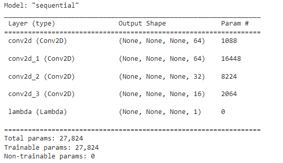
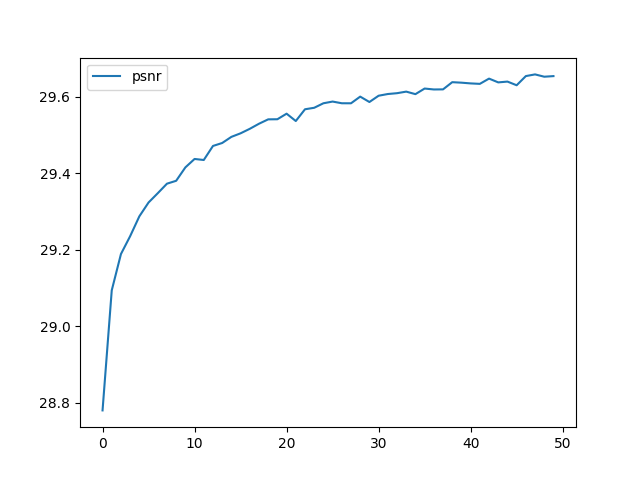
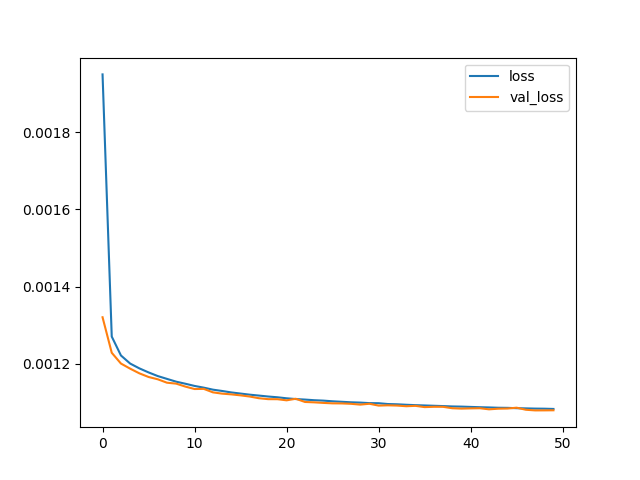
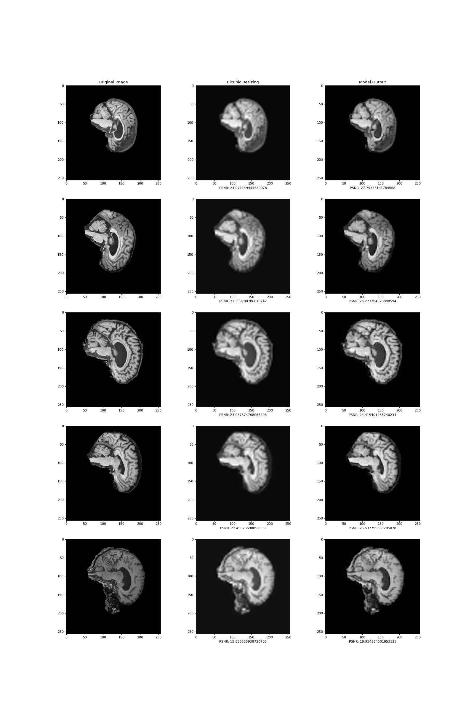

# Brain MRI Super-Resolution Network - 46464383
This algorithm leverages an Efficient Sub-Pixel CNN (ESPCN) to upsample an image when given a low resolution version. These techniques have applications in HDTV, medical imaging, satellite imaging as well as in face recognition and surveillance [2]. In this report, I am focusing on medical imaging. My algorithm upsamples MRI brain scans to prodice a higher resolution image. By increasing the resolution, a clearer picture can be extracted, allowing medical practitioners to view and analyse the output with more clarity. Generally, a high resolution is required to facilitate accurate and early diagnosis [3]. This can be hindered by short time frames and patients' motion during the scan which may result in blurry images [3].

The basic model structure was taken from Reference 1. The model consists of 3 Conv2D (convolutional) layers which apply a decreasing number of kernels (filters) to the input image, this produces a set of feature maps to extract the important features of the image. The final stage in the model is an efficient sub-pixel convolutional layer which actually upscales the image to the intended size (x4) by aggregating the feature maps. In practice, this is comprised of a Conv2D layer and a tensorflow function to change the image dimensions. The ESPCN is more effective than other models in the super-resolution space as it performs the upscalling as the last layer, this means that the model is aiming to learn from the input image rather than learn how to undo the blur in an already upscaled image.

Image sourced from [2]

## Dependencies
- Tensorflow 2.9.2
- Keras 2.9.0
- Matplotlib 3.2.2
- PIL 7.1.2
- Numpy 1.21.6

math and os libraries are also used (Python 3.7.15)

The code run with these libraries should produce similar results to those presented in this report. However, due to the nature of a neural network, there will be variations in exact training and testing scores.
## Usage
To run the training code, first edit the relevent constants in `constants.py` eg. epochs, checkpoint location etc. Then run `train.py` to train the model. To produce the visualisations, run `predict.py` to generate comparison images. See `predict.py` function `produce_comparison_plot` for how to preprocess the test images to feed into the model.
### Inputs
The input into the model is a 64x64x1 image of an MRI.
### Outputs
The output of the model is a 256x256x1 upscaled version of the same MRI scan. The quality of the upscaled image is measured by the Peak Signal-to-Noise Ratio (PSNR), a common metric for evaluating the capabilities of an image 'processing' model (a model where the output is comparable to the input). This is calculated using the Mean Squared Error (MSE) between the original image and the output image. PSNR is measured after each epoch suring training to provide statistice on the model's improvement. This is done with the PSNR_Callback class within modules.py.

The output of this can be seen in the figure below. As you can see by the y axis, the score started off high and increased by about 1 during the 50 epochs. It is common for ESPCN models to behave in this way as they are designed to be less computationally expensive to train, requiring less epochs on average. A graph with y-axis (0,30) is included in the ./images folder.

For the same reason, the loss (and validation loss) of my model was quite small initially and decreased slightly over the 50 epochs.

The image below details the PSNR of my model's output compared to a simple bicubic resizing of the image. As seen in the figure, my model generally out performs the bicubic resize. This figure has been generated using 5 images from the test set so it is to be expected that the PSNR is less than the training score as a little overfitting may have occurred.

## Preprocessing
The preprocessing steps included:
- Padding the images with black (256, 240) -> (256, 256) to make them square
- Converting to YUV colour space (and only using Y) to reduce to one colour channel (greyscale)
- Downsizing by 4x to produce input images

I did not create the training and test split, it was provided for me in the dataset.
For the training and validation split, I used the fairly standard split of 80%-20% training-validation.

## References
[1] https://keras.io/examples/vision/super_resolution_sub_pixel/#run-model-prediction-and-plot-the-results

[2] https://arxiv.org/pdf/1609.05158.pdf

[3] https://onlinelibrary.wiley.com/doi/epdf/10.1002/cmr.a.21249

[4] https://medium.com/@zhuocen93/an-overview-of-espcn-an-efficient-sub-pixel-convolutional-neural-network-b76d0a6c875e
