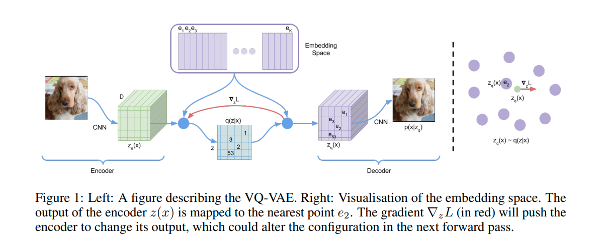

# Generative Model using VQ-VAE + PixelCNN
The project involves the creation of a generative model using the OASIS brain image dataset. The 2 models used to generate
the brains is a) VQ-VAE (Vector-Quantized Variationl Autoencoder) to learn the latent representation of the brain and 
b) DCGAN to learn the distributions so that it can randomly sample from this distribution to generate novel brain 
images

## Usage Details
### Dependencies

numpy==1.20.4
tqdm==4.62.1
opencv==8.3.6
tensorflow == 2.7.0
matplotlib == 3.4.2
tensorflow_probability == 0.14.1
random
os

To reproduce the results using the OASIS dataset, you will need to restructure them as specified in dataset loader
path. Modify the data folder accordingly in driver.py and run the code to generate output. 

The results may not be as displayed below due to the inherent volatility in DCGANs and VQ-VAE. To get the best performance
out of the model, I recommend multiple runs of the driver.py and choosing the best performing model. ANY LIMITATIONS

## Model Explanation:
### VQ-VAE
An Autoencoder is a neural network which aims to map large images to a more compressed representation called the latent
space.The input images are fed through the encoder, which the maps this input to the aformentioned latent space (i.e
into a smaller representation of the same image). These latent space vectors are then fed into the decoder network
which maps the latent space back to the original input size, in the hopes of reconstructing the original image. The
reconstructed image and the original image are compared through an MSE loss (also known as reconstruction loss) 
which is then used to update the parameters of the encoder and decoder.

VQ-VAE builds on top of the variational autoencoder by quantizing the continuous latent space representation into a
discrete version. Each vector in the encoded latent space is "snapped" or mapped to the closest vector in the embedding 
space (otherwise  known as the codebook) based on the L2 norm. These vector-quantised are represented through the 
codebook indices q(z|x) which is then passed through the decoder to reconstruct the original image.

The vectors in the codebook are initialzed from a uniform prior. The loss used to update the parameters of the model
during training is described by eq (3) in the original VQ-VAE paper [1].

## Implementation:

## Results:

## Bibliography: