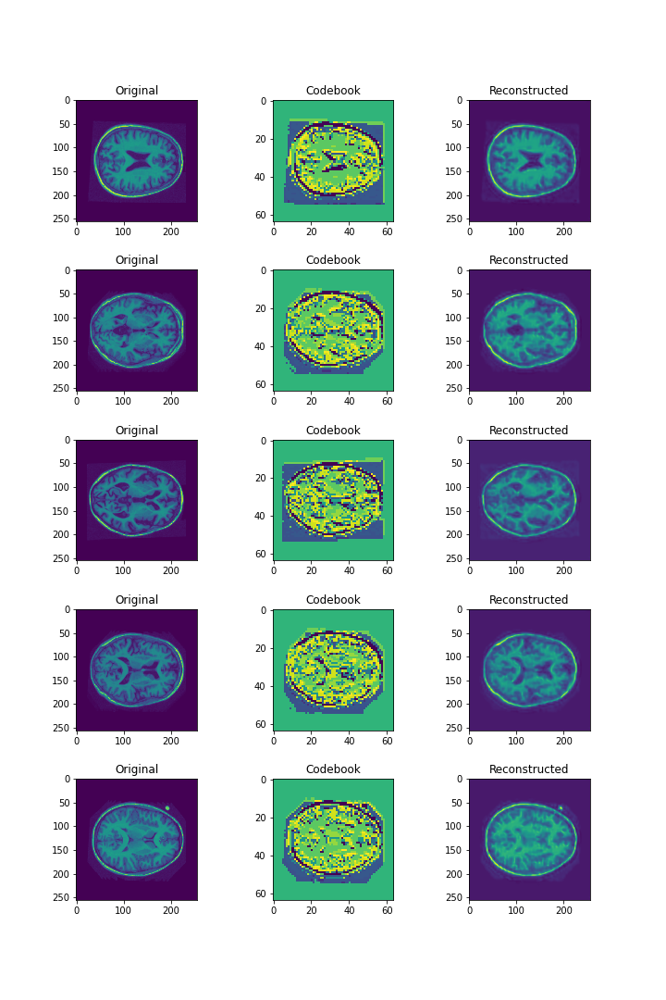
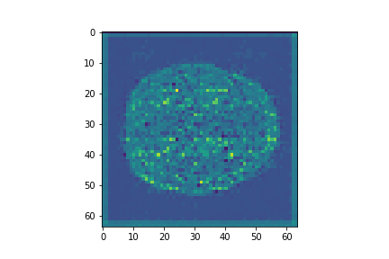

# Generative Model using VQ-VAE + DCGAN
The project involves the creation of a generative model using the OASIS brain image dataset. The 2 models used to generate
the brains is a) VQ-VAE (Vector-Quantized Variational Autoencoder) to learn the latent representation of the brain and 
b) DCGAN to learn the distributions so that we can randomly sample from this distribution to generate novel brain 
images.

## Usage Details
### Dependencies
numpy==1.20.4
tqdm==4.62.1
opencv==8.3.6
pytorch_msssim
matplotlib == 3.4.2
random
os

To reproduce the results using the OASIS dataset, you will need to restructure them as specified in dataset loader
path. Modify the data folder accordingly in driver.py and run the code to generate output. 

The results may not be as displayed below due to the inherent volatility in DCGANs and VQ-VAE. To get the best performance
out of the model, I recommend multiple runs of the driver.py and choosing the best performing model. ANY LIMITATIONS

## Model Explanation:
### VQ-VAE
An Autoencoder is a neural network which aims to map large images to a more compressed representation called the latent
space.The input images are fed through the encoder, which the maps this input to the aforementioned latent space (i.e
into a smaller representation of the same image). These latent space vectors are then fed into the decoder network
which maps the latent space back to the original input size, in the hopes of reconstructing the original image. The
reconstructed image and the original image are compared through an MSE loss (also known as reconstruction loss) 
which is then used to update the parameters of the encoder and decoder.

VQ-VAE builds on top of the variational autoencoder by quantizing the continuous latent space representation into a
discrete version. Each vector in the encoded latent space is "snapped" or mapped to the closest vector in the embedding 
space (otherwise  known as the codebook) based on the L2 norm. These vector-quantised are represented through the 
codebook indices q(z|x) which is then passed through the decoder to reconstruct the original image.

The vectors in the codebook are initialised from a uniform prior. The loss used to update the parameters of the model
during training is described by eq (3) in the original VQ-VAE paper [1].

### DCGAN
One of the problems with using a uniform prior is that you haven't learnt the distribution of the input images and 
you can't sample and create new images from this. As such, to generate images we train a DCGAN to learn the distributions
of the images. DC-GAN is used to replace the codebook by learning the representation of the embedding space or the 
codebook indices. DC-GAN consists of 2 parts - namely the generator and the discriminator. The generator is passed 
random noise from which it generates the codebook indices q(z|x) and the discriminator is fed either fake codebook 
indices (from the generator) or real codebook indices generated from the trained VQ-VAE model in the previous part. Once
the generator has been trained, the outputs from the trained generator are then mapped to discrete codebook indices
values by evenly binning them depending on the amount of unique discrete values in the codebook indices, q(z|x).

## Implementation:
### VQ-VAE
The architecture for VQ-VAE is shown below along with the dimensions after each change: 

Layer | Filters | Kernel | Stride | Padding | Input Shape | Output Shape 
:---: | :---: | :---: | :---: | :---: | :---: | :---: 
Conv2d + ReLU | 16 | 3 | 1 | 1 | (1 x 256 x 256) | (16 x 256 x 256) 
Max2D Pool | - | 2 | - | - | (16 x 256 x 256) | (16 x 128 x 128) 
Conv2d + ReLU | 8 | 3 | 1 | 1 | (16 x 128 x 128) | (8 x 128 x 128) 
Max2D Pool | - | 2 | - | - | (8 x 128 x 128) | (8 x 64 x 64) 
Pre_VQ Conv2d  | 64 | 1 | 1 | 0 | (8 x 64 x 64) | (64 x 64 x 64) 
Vector Quantized | - | - | - | - | (64 x 64 x 64) | (1 x 64 x 64) 
Conv2d + ReLU | 8 | 3 | 1 | 1 | (1 x 64 x 64) | (8 x 64 x 64) 
Upsampling | - | 2 | - | - | (8 x 64 x 64)  | (8 x 128 x 128)  
Conv2d + ReLU | 16 | 3 | 1 | 1 | (8 x 128 x 128) | (16 x 128 x 128) 
Upsampling | - | 2 | - | - | (16 x 128 x 128)  | (16 x 256 x 256)  
Final Conv2d  | 1 | 3 | 1 | 1 | (16 x 256 x 256) | (1 x 256 x 256) 

The architecture for the generator was from [2]:  

The models described above are implemented in the following modules: 

## Results:
For the input to VQ-VAE, it was the full grayscale image (pixel ranging from  0-255) and no pixel normalisation was 
applied to the input images. The testing and training sets was not changed from the folders themselves, and the validation
set was ignored as it does not serve a purpose in VQ-VAE or DCGAN.
### VQ-VAE
The VQ-VAE was trained for 1500 epochs.  The reconstruction loss for the VQ-VAE is shown below:
  

    We can see that the reconstruction error decreases but there are moments when there is a sharp drop in reconstruction
loss followed by periods of steady fall. Training it for longer would likely reduce the reconstruction error but
for our purposes, reconstruction errors around ~0.133 were sufficient. To see this is the case, we have plotted some
reconstructed images, codebook indices and actual images using the `VisualiseVQVAE.real_codebook_reconstructed` 
function:     

We can see that the reconstructed images match the original inputs very well. To test this we can use the 
`VisualiseVQVAE.mean_ssim_vqvae` function which gives an SSIM of **0.95815**.

### DCGAN
One detail about training a DCGAN is that if the learning rate is not right then GANs can suffer from mode collapse
in which the generator, 
Using a learning rate of 0.0002, gave the best results. Below, we can see the output produced by the generator after
it has been discretised (using the `predictGAN.generate_discrete_indices` function): 
    

    
Passing these indices through the decoder gives the following novel image (using the 
`predictGAN.generate_decoder_sample` function): 
    

    
If we compare this generated sample with the test set to determine the average SSIM, we find that between the test
set and the generated sample, the average SSIM is **0.631395** with **400/544** samples having an SSIM greater than 0.6. 
(using the `predictGAN.mean_ssim_test_set` function).

## Bibliography
[1] van den Oord, A., Vinyals, O., & Kavukcuoglu, K. (2017). Neural Discrete Representation Learning. CoRR, 
abs/1711.00937. Opgehaal van http://arxiv.org/abs/1711.00937

[2] Alec Radford, Luke Metz, & Soumith Chintala. (2016). Unsupervised Representation Learning with Deep 
Convolutional Generative Adversarial Networks.