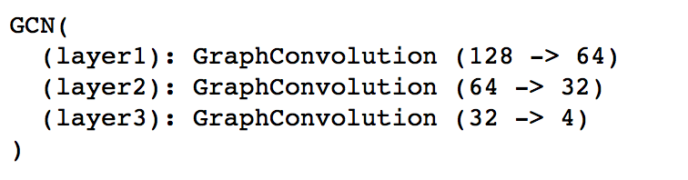
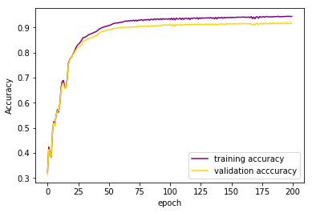
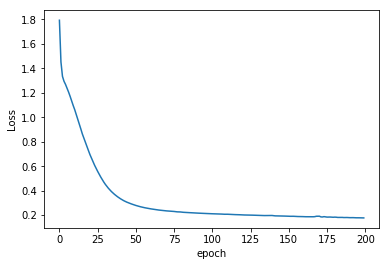
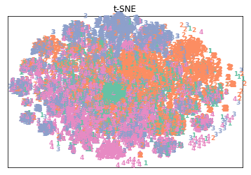
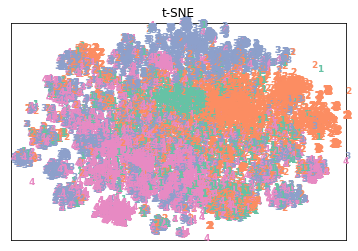
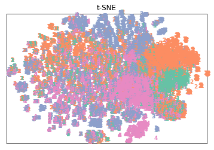

# Build GCN model for facebook dataset of over 91% accuracy
***
by: Kexin Peng, 2021

This is an implementation of muilti-layer Graph Convolutional Network for [semi-supervised node classification](https://arxiv.org/abs/1609.02907) using PyTorch. This implementation aims to classify nodes using the partially processed [dataset](https://graphmining.ai/datasets/ptg/facebook.npz) of [Facebook Large Page-Page Network Dataset](https://snap.stanford.edu/data/facebook-large-page-page-network.html). 

The acccuracy achieved using the codes are around:
* Training accuracy: 94.5%
* Validation accuracy: 91.9%
* Test accuracy: 91.2%

## Dataset
***
The partially processed [dataset](https://graphmining.ai/datasets/ptg/facebook.npz) consist of data about edges in the graph, node features, node labels. Total number of nodes is 22470, of 4 ccategories and each node has 128 features.

### data preprocessing
The preprocessing steps are included in the test.py file. The steps mainly include: build adjacency matrix based on the 'edges' data, transform the data into the format of PyTorch tensor and normalize matrix data.

In order to implement semi-supervised classification, the proportion of **train : validation : test data** is: **2 : 2 : 6**
If you want to change the proportion, you can change the code for `train_index`, `val_index` and `test_index` in `test.py` file.

## GCN model
***
The basic idea of GCN model is to aggregate information of a node's neighbors and itself and pass all the information to neural nets. The model takes in feature matrix and adjacecncy matrix and outputs the scores of categories for nodes.

The `algorithm.py` includes codes for Graph Convolution layer and GCN model of both 2 layers and 3 layers. The code in the `test.py` file use the 3 layers GCN by default.

The structure of 3 layers GCN used in my implementation is:


You can change parameters for your 3 layers GCN(or 2 layers GCN) by changing the `hidden1`, `hidden2`(or `hidden` for 2 layers GCN) and dropout in the `test.py` file.

In my implementation, I train for 200 epochs with 0.01 learning rate. You can change the `epochs` and `learning_rate` in `test.py` file.

## Run the code
***
Put the dataset file `facebook.npz` with code files `algorithm.py` and `test.py` into the same folder, you can run the test script by using:
```
python test.py
```
*You can copy and paste the code to Jupyter notebook and run `test(test_index)` after the training to see the test accuracy.*

## Result of 3 layers GCN model
***
- The accuracy history:



- The loss history:



## TSNE embeddings plot
***
The code for showing TSNE embeddings plot is in `test.py` and you can uncomment the code at last of the file to implement TSNE and plot the figure. Since it's recommended to implement PCA first to reduce the number of dimensions to resonable amount (e.g. 50), I tried to implemented PCA and reduce dimensions to 90 and 50 separately. The first 90 components can hold around 84% of the total variation in the data and the first 50 components hold 56%. I also tried directly implrmrnt TSNE. The plots are listed below:
- Direct TSNE:



- TSNE after PCA to 90 dimensions:



- TSNE after PCA to 50 dimensions:



## Dependencies
***
- Python 3.7.1
- numpy 1.17.3
- PyTorch 1.5.0
- matplotlib 3.0.2
- scipy 1.5.2

## Reference
***
The paper [Semi-Supervised Classification with Graph Convolutional Networks](https://arxiv.org/abs/1609.02907)

[Reference code for Graph Convolutional Network](https://github.com/tkipf/pygcn/tree/1600b5b748b3976413d1e307540ccc62605b4d6d)
