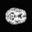

# Stable Diffusion generative model on OASIS brain dataset


Diffusion is a new class of generative technique. The idea was proposed by (Sohl-Dickstein, et al.) in 2015, where  a model generates an image from Noise.

This is a Tensorflow implementation of Stabel Diffusion on the OASIS brain dataset.

The main idea in this implimentation is from [Image generation with diffusion models using Keras and TensorFlow](https://medium.com/@vedantjumle/image-generation-with-diffusion-models-using-keras-and-tensorflow-9f60aae72ac).

The code of this project can be also found in the [Google Colab](https://colab.research.google.com/drive/1ebIE7dlwSnsaJe7G0ngCuGTSa9qdSVKz?usp=sharing) .  
<br>

## Environment Requirements

* OS: Windows10/11 64bit, Linux 64bit. (Excluding MacOS as tensorflow_addons has no MacOS version on anaconda currently. Google Colab can be utilized on MacOS for alternative)
* Python 3.7+
* Tensorflow 2.8.1 + 
* CUDA Version: 11.2   
<br>

## Installation

###  1. Install the Tensorflow
If there is no Tensorflow in your computer, please install the Tensorflow 2.8.1+.
```
$ pip install tensorflow
```
If you use Anaconda, use this command:
```
$ conda install -c conda-forge tensorflow
``` 
### 2. Install tensorflow_addons
The tesnorflow_addons has no MacOS version in anaconda. Install tensorflow_addons using the following command:
```
$ pip install tensorflow_addons
```
If you use Anaconda, use this command:
```
$ conda install -c esri tensorflow-addons
```
### 3. Install einops
The rearrange function in einops library is useful for time embedding in Attention.Install einops using the following command:
```
$ pip install einops
```
If you use Anaconda, use this command:
```
$ conda install -c conda-forge einops
```  
<br>

## Code Usage

There are four .py files in this repository:
* dataset.py
* modules.py
* predict.py
* train.py

The dataset.py and modules.py are support files including some support functions. The predict.py and train.py files are excuting files for predicting a picture and training a model from the OASIS brain dataset, respectively.

###    1. Parameter Setting  
####  1.1 train.py  
* PATH = "./dataset/keras_png_slices_data.zip"  
    The path of zipped image dataset  
* NUMBER_OF_SAMPLES = 2000  
    The number of image samples used to training  
* IMAGE_SIZE = (128, 128)  
    The size of training image.
* CKPT_PATH = "./checkpoint"  
    The path of the checkpoint  
* EPOCS = 30  
    The training epochs.
* BATCH_SIZE = 16  
    The training batch size.  
#### 1.2 modules.py  
* timesteps = 1000  
    The totla time steps of adding noise / denoising  

The reason why I didn't use argument transmitting from python command is the predict function use some parameters imported from train.py. The predict.py will read the path of the checkpoint set in the train.py file. I will use the argument transmitting in the following version.  

#### 1.3 predict.py  
* GIF_PATH = "./gif/"  
    The path for saving the .gif file of generation process.

### 2. Code Excution  
After setting the parameters, open the Terminal (Command line) under this file folder, then type the command as follows:  
* Training model:
```
$ python train.py
```
* Generating a picture:
```
$ python predict.py
```  
* Test models
```
$ sudo sh test.sh
```


<br>

## Stable Diffusion  

Stable Diffusion is an AI-generated text-to-image model that will empower billions of people to create stunning art within seconds. The structure of Stabel Diffusion is shown as follow:

<p align='center'> Fig.1. Stable diffusion structure </p>    

From the Fig.1 we can see the process of the diffusion model can be divided into two phase:  
* Forward adding noise phase
* Backward denoising phase


### 1. Forward Adding Noise  
The concept of diffusion is from the physics concept. In Physics, diffusion is defined as a process in which an isolated system tries to attain homogeneity by by altering the potential gradient in response to the introduction of a new element.

Considering a picture in Fig.2, we gradually add a small amounts of random noise into the picture at a time. After hundreds of steps, the picture will become unrecognizable.


<p align='center'> Fig.2. Picture diffusion process </p> 

This process follows the Markov Chain which is a chain of events in which an event is only determined by the previous event. Here we denote $x_0$ as the original picture, $x_t$ as the final unrecognized picture (random noise). We can define the process as :  
$$q(x_t|x_{t-1})=N(x_t;\sqrt{1-\beta_t}x_{t-1},\beta_tI)$$   
Here $\beta$ follows a variance schedule of linier increase from 0.0001 to 0.02.  
The process from $x_1$ to $x_t$ can be define as:  
$$q(x_{1:T}|x_0)=\prod_{{t=1}}^{T} q(x_t|x_{t-1})$$  

However, this process of adding noise is ineffective as we must calculate the previous $x_{t-1}$ steps if we want to get a random picture in time $t$ .Here we introduce a new variable $\alpha$ : $$\alpha_t = 1-\beta_t$$ $$\overline \alpha_t = \prod_{s=1}^T\alpha_s$$ $$q(x_t|x_0)= N(x_t;\sqrt{\overline\alpha_t}x_0,(1-\overline\alpha_t)I)$$ Now, we can get $x_t$ from $x_0$ in one step of calculation.

This definition of $\beta$ and $\alpha$ can be found in the code of [here](modules.py#L26-L34).


### 2. Backward Denoising  

The backward phase is the reverse of the forward phase. We want to denoise the picture step by step and finally get a legible picture, see Fig.3.


<p align='center'> Fig.3. Denoising process </p> 

For the backward phase, we use an Attantion U-NET to predict a noise picture in each step. The Conditioning block in the Fig.1 is where the attantion comes from in the U-Net. The block can be a transformer model or a word-to-vector model which can generate a vecor including some words information.

However, this porject is using the OASIS brain dataset which concentrates on a single pattern of images, being hard to be described by some words. Thus, I use the time embedding attention to alter the word embedding attention in the U-Net, see Fig.4.


<p align='center'> Fig.4. Attention U-Net </p> 

Now, we have the structure of the backward denoise Attention U-Net Model. We need to choose optimizer and loss fuction. We will use Adam optimizer with a initial learning rate of $1e-4$ .  

We calculate the loss between the predicted noise $\epsilon_0$ and the original noise $\epsilon$ by the following formula:   $$Loss_{simplified}(\theta)=\mathbb{E}_{t,x_0,\epsilon}[||\epsilon-\epsilon_0(\sqrt{\overline\alpha_t}x_0+\sqrt{1-\overline\alpha_t}\epsilon,t)||^2]\qquad \epsilon \in{N(0, I)}$$   This loss function is the L1 loss between predicted noise and the original noise.  
<br>

## Results

The models are trained on the Google Colab pro with NVIDIA Tesla T4 15GB GPU. The whole experiment process costs around 150 compute units. The results are shown as follows:  
* 64X64 Images  
    IMAGE_SIZE = (64, 64)  
    BATCH_SIZE = 64  
    EPOCHS = 50  
    
    

* 128X128 Images  
    IMAGE_SIZE = (128, 128)  
    BATCH_SIZE = 16  
    EPOCHS = 100  
    
      

* 256X256 Images  
    IMAGE_SIZE = (256, 256)  
    BATCH_SIZE = 4  
    EPOCHS = 200  
    

The model did not converge well on the 256X256 size images. One possible reason is the batch size being too small, only 4. The training process was limited by the graphical memory size. I can only choose the largest image space and batch size combinations listed above. Too big batch size will triger the Out Of Memory(OOM) error.
<br> 

## Reference:  
[1] Image generation with diffusion models using Keras and TensorFlow. url:[https://medium.com/@vedantjumle/image-generation-with-diffusion-models-using-keras-and-tensorflow-9f60aae72ac](https://medium.com/@vedantjumle/image-generation-with-diffusion-models-using-keras-and-tensorflow-9f60aae72ac)  
[2] High-Resolution Image Synthesis with Latent Diffusion Models. url: [https://ommer-lab.com/research/latent-diffusion-models/](https://ommer-lab.com/research/latent-diffusion-models/)  
[3] Stable Diffusion. [(GitHub)](https://github.com/CompVis/stable-diffusion)  
[4] Denoising Diffusion Probabilistic Models [(Paper)](https://arxiv.org/pdf/2006.11239.pdf)  
[5] Denoising Diffusion Implicit Models [(Paper)](https://arxiv.org/pdf/2010.02502.pdf)  
[6] Attention U-Net: Learning Where to Look for the Pancreas [(Paper)](https://arxiv.org/pdf/1804.03999.pdf)