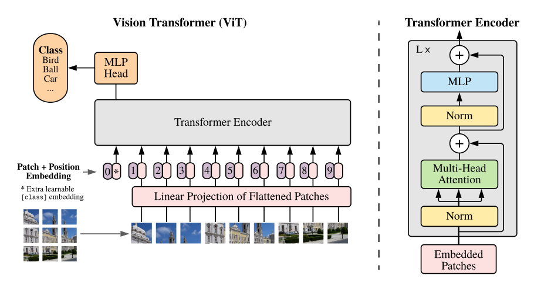
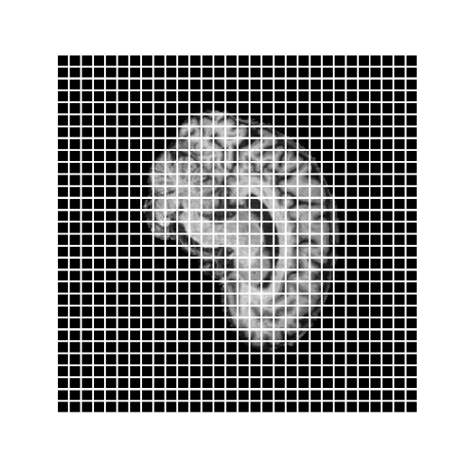
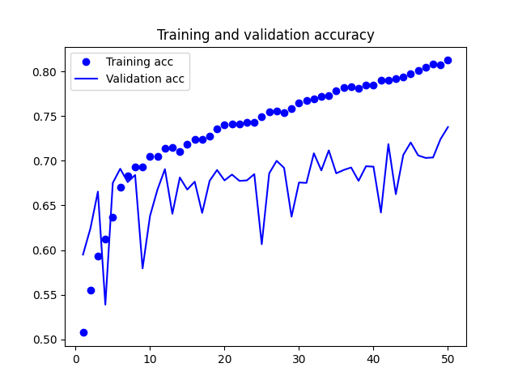
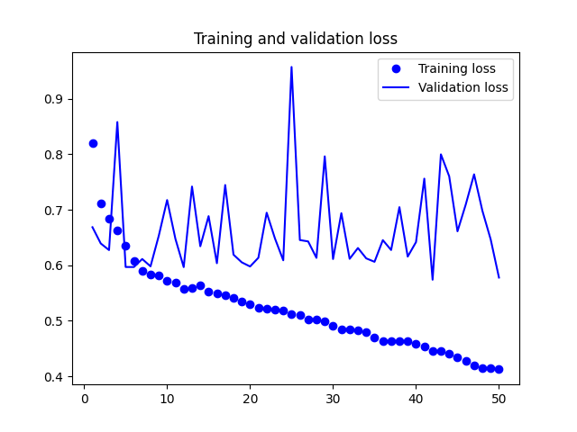

<!--1.The readme file should contain a title, a description of the algorithm and the problem that it solves, how it works in a paragraph and a figure/visualisation.
%2. It should also list any dependencies required, including versions and address reproduciblility of results, if applicable. -->

# Classifying Alzheimers using Vision Transformers
Using neural networks in the medical field is an exciting new field of work which can have huge implications for the accuracy of diagnosises and could improve treatment quality for patients. In this project we attempted to use Vision Transformers (ViT) to classify brain MRI scans to be used in the identification of Alzheimers disease. This work was largely based on the paper by [Dosovitskiy, et al. (2020)](#references). Technology like this can be used in various medical applications and can provide medical staff with assistance in identification and classification. Particularly in remote areas with less specialists, these models can assist doctor's preliminary diagnoses in ways never before seen. 

## How it works
___
A Vision Transformer is an adaptation of a traditional transformer, which takes the encoder portion of the transformer and uses it to classify images. Transformers traditionally take sequential data and produce similar data types, like language translation, text generation, etc. Images can be used with a modified version of a transfomer since it does have an aspect of sequence, by considering the image split into patches and passing those patches in a given order. To preserve the 2D spatial nature of the image, positional embeddings are added to each patch. In addition, a class token is attached to the beginning of the data sequence to later be used in identifying the type of image.

 \
[(Dosovitskiy, et al., 2020)](#references)

The main component of the ViT which allows for this funcionality is the Multi-Head Attention (in this context it can also be called Self-Attention since it is being applied to itself). This layer of the model is used to identify relationships between different pixels. In a traditional transformer, this would be used to identify relationships between words and how they relate in sentences, etc. Attention layers are used in detecting relationships or dependancies between elements, even when those relationships can be distant [(Vaswani, et al., 2017)](#references). This allows the model to determine relationships between the pixels in the data, in a similar way to how traditional CNN compute relationships in an image.

## Reproducibility
___
### Versions
* ```tensorflow = 2.10.0 ```
* ```tensorflow-gpu = 2.6.0 ```
* ```tensorflow-datasets = 1.2.0 ```
* ```cudatoolkit = 11.7.0 ```
* ```cudnn = 8.4.1.50 ```
* ```matplotlib = 3.6.1 ```
* ```numpy = 1.23.4 ```

### Run for yourself
To run the code for yourself, simply change the placeholder paths in the following files:

* ```"<INSERT TRAIN DATA PATH>"``` and ```"<INSERT TEST DATA PATH>"``` in ```dataset.py``` - This is where the data to be loaded should be saved. It should have the file structure: 
    ```
    training_data/
        AD/
            IMAGES
            ...

        NC/
            IMAGES
            ...
        
    testing_data/
        AD/
            IMAGES
            ...
            
        NC/
            IMAGES
            ...
    ```

* ```"<INSERT MODEL PATH>"``` in ```train.py``` - This is the path where the model will be saved and can be loaded from.

## Model
___
### Data Preparation / Preprocessing
The preprocessed version of the [ADNI Alzheimers dataset](https://adni.loni.usc.edu/) was downloaded and unzipped into a folder. The data was split into a training and test set, with each dataset containing a split between alzheimers and control patients. Each patient had a unique patient ID which ensured their 20 images MRI images were kept together. This is important for splitting the training dataset into a validation set [(described below)](#dataset-splits).

 \
*Above: Image after applying patching process*

The data was imported into the model by using the ```keras.preprocessing.image_dataset_from_directory()``` method. All preprocessing was done within the keras model; using ```Rescaling```, ```RandomRotation``` and ```RandomFlip```. The rescaling is used to normalise the pixel values between [0, 1]. The rotation and flip augmentations are used to help preserve rotational, horizontal and vertical symmetries. All of which should help promote generalisability for brain images which aren't like the training set.

### Dataset Splits
The dataset originally had 2 data splits, training and testing. To split the training data into a validation set aswell, it had to be done so that the images contributing to the same patient were not used between the training and validation set. The splits were done at approximately 90% training, 10% validation. Since each patient had 20 scans done, these percentages were rounded to the nearest multiple of 20 images, so that no patients images were split between datasets. The testing dataset was simply used in the ```predict.py``` file to display results.

### Hyper-parameters
The hyper-parameters given in the original paper [(Dosovitskiy, et al., 2020)](#references) were vastly unusable for our dataset. The data we had access to was very small and the computation power was smaller. Since the amount of data was much smaller, the model architecture was not as large as described in the paper. For example in the paper it suggested 12 transformer layers, while in our examples 4 layers were used.

Below is a list of the different parameters, a description and the value used in our final example.

    Patch Size - Size of patches that each image was split into = 8x8
    Batch Size - Size of each batch to train data on = 32
    Image Size - Size of each image processed by the model = 240x240
    
    Number of Layers - Number of transformer encoders to use in the model = 4
    Number of Heads - Number of heads in the MultiHeadAttention layer = 4
    MLP Depth - Depth of multi-layer perceptron network = 1000
    Head Depth - Depth of MLP used for class classification = 300
    Dropout Rate - Rate of dropout in the dropout layers = 0.2
    Learning Rate - Rate of learning for Adam optimizer = 0.0003

## Results
___
After a large number of tests tuning the hyper-parameters, the model was trained using the ones listed above. 90% of the data from the training dataset was used to train with, and 10% used for validation [(split as described above)](#dataset-splits). The model was trained with the previously mentioned hyper-parameters on the UQ Rangpur GPU Cluster for 50 epochs. The testing and validation accuracy were 81.27% and 73.79% respectively.



The validation accuracy wasn't as smooth as the training, but still showed slow positive improvement. The loss was also quite eratic. 



These are all indicators that some level of overfitting may be occuring, which could be attributed to the fact that the datasets are relatively small. The original ViT paper was trained on datasets with between 14-300M images, while our dataset was only about 20~30K images.

The results given from the ```predict.py``` file were:

``` Model accuracy: 68.76%, Model loss: 0.76 ```

This shows a decent result from the model, however, some overfitting is still present. 

## Future opportunities
___
More data is likely needed to significantly improve the results of the model. There is research taking place in the field of ViT for small datasets which may be of use if more data can't be obtained [(Lee, et al., 2021)](#references).

There are papers [(Xiao, et. al 2021)](#references) that suggest that applying convolutional layers before the ViT can improve performance. This is an interesting prospect that could be experimented with to determine how positive of an effect it has on our dataset. 

## References
___
* Dosovitskiy, A., et al. (2020). "An Image Is Worth 16x16 Words: Transformers For Image Recognition At Scale." https://arxiv.org/abs/2010.11929
* Xiao, T., et al. (2021). "Early Convolutions Help Transformers See Better." https://arxiv.org/abs/2106.14881
* Lee, S., et al. (2021). "Vision Transformer for Small-Size Datasets" https://arxiv.org/abs/2112.13492
* Vaswani, A., et al. (2017). "Attention Is All You Need" https://arxiv.org/abs/1706.03762
