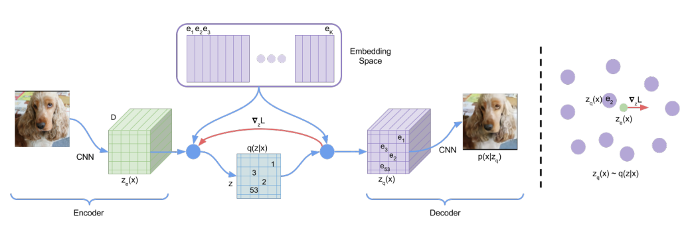
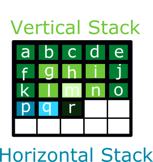
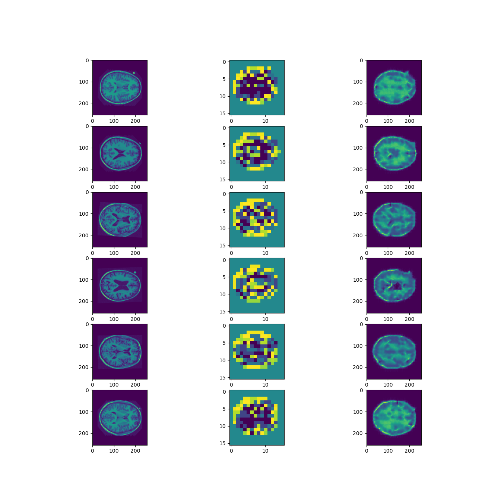
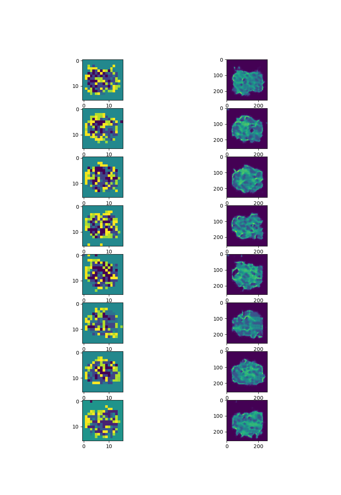
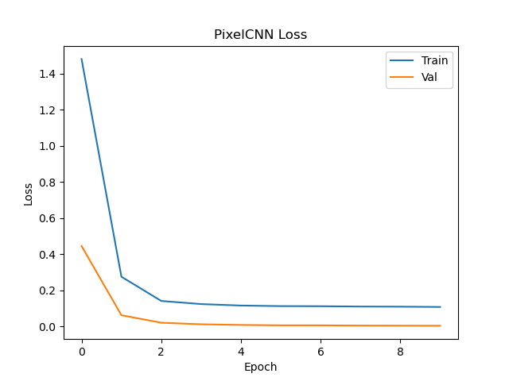
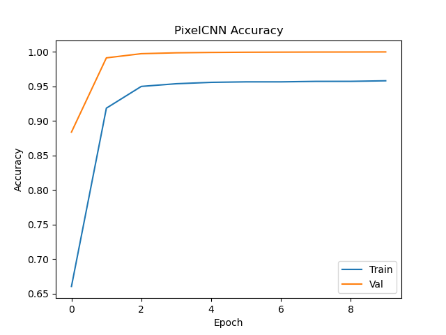

# VQVAE and PixelCNN Generative Model for OASIS Brains Dataset
This project implements the VQVAE [3] and PixelCNN models to encoded and generate images of brains based on the OASIS Brains dataset.
# Background Information & Architecture
## VQVAE


The VQ-VAE [3] is an extension of the autoencoder model which quantizes latent vectors, mapping them to a discrete codebook. This is done by inserting a vector quantisation layer between the encoder and decoder.

The encoder consists of n layers which each halve the size of the image, producing a set of latent vectors of dimension D, and the decoder uses upscaling convolutional layers to reverse this.

The Vector Quantisation (VQ) layer contains a codebook of K vectors of dimension D. It maps the vectors produced by the encoder to the nearest vector (using euclidian distance) in the codebook, before sending them to the decoder.

The VQ-VAE uses SSIM as a loss function between the input image and decoded output.

As quantisation is non-differentiable, gradients skip the vector quantisation layer. Additionally, the codebook is trainable, trained based on the error between each input latent vector and its codebook mapping.


## PixelCNN


The PixelCNN [2] is an auto-regressive model trained to generate indices of the codebook vectors used by the decoder in the VQ-VAE.

The PixelCNN uses PixelConvLayers which are convolutional layers with masks of types A and B. Both masks mask out all pixels after the central pixel in the kernel, and Mask A further masks out the central pixel of the kernel.

Standard PixelConvLayers suffer from a blindspot [4] which is solved by further breaking them into two types, V and H, representing the vertical and horizontal stack. Any usage of the PixelConvLayer uses each seperately and combines the result afterwards.

The PixelCNN model has the following structure:
- One Type A PixelConvLayer with kernel covering the full image
- Two ResidualBlocks[2] consisting of
  - A single standard conv layer
  - A type B PixelConvLayer with kernel size 3
  - A single standard conv layer
  - An additive layer, combining inputs to the block and the output of the block
- Two Type B PixelConvLayers with kernel size 1
- A standard convolutional layer outputting latent dimension vectors

# Dataset
The model is designed for use with the OASIS brains dataset. The files should be unzipped into the main project directory and be named `keras_png_slices_data` for the loader to see them.

The training and validation data is redistributed in order to provide more training data. 10% of this combined data is used for validation. The testing data is kept entirely seperate to avoid leakage.

No augmentation is applied, however the images are modified to have pixel values from 0 to 1 instead of 0 to 255. 

After first loading the data, it will be saved to data.pkl for faster access on future loading. If for some reason an error occurs, or the program is stopped while saving data and this file is corrupted, simply delete it to cause a complete reload of the data on the next execution.

# Dependencies
```
python=3.9.12
matplotlib=3.5.3
opencv-python=4.6.0.66
tensorflow=2.9.1
numpy=1.22.4
```
The model was tested with tensorflow-rocm 2.10.0.520 on an AMD Gpu, however it should run on an nvidia gpu using cudnn and cudatoolkit versions appropriate to tensorflow 2.9.1.

# Instructions
Make sure to download the OASIS brain dataset and unzip it into the main project directory. It should be named "keras_png_slices_data".

If any .pkl, or .ckpt files exist and you want to train a fresh model, delete them.

Run driver.py with python.

# Results
Results are not perfectly reproducible as PixelCNN randomly generates images, and training data is shuffled. Seeding can be used to overcome this.
## VQ-VAE Results
The preset parameters used by driver.py will achieve approximately 90% of images having SSIM greater than 0.6, with a mean SSIM of 0.64. By changing the hyparameters it is possible to achieve 100% over 0.6, with a mean of 0.95, however that lead to reduced generative capabilities.

The below figure demonstrates original images (left), encoded image (center) and decoded image (right) for a random sample of 6 images.


A graph of loss for the VQVAE is not included as it is only trained on 2 epochs.

## PixelCNN Results
The below figure demonstrates generated encodings (left) and decoded images (right) for the PixelCNN.





# References
[1]Yadav, S. (2020) Understanding vector quantized variational autoencoders (VQ-VAE), Medium. Medium. Available at: https://shashank7-iitd.medium.com/understanding-vector-quantized-variational-autoencoders-vq-vae-323d710a888a (Accessed: October 6, 2022). 

[2]Paul, S. (2021) Keras documentation: Vector-quantized variational autoencoders, Keras. Available at: https://keras.io/examples/generative/vq_vae/ (Accessed: October 11, 2022). 

[3]A.v Oord, O. Vinyals and K. Kavukcuoglu. (2018) Neural Discrete Representation Learning, Arxiv. Available at https://arxiv.org/abs/1711.00937 (Accessed: October 6 2022).

[4]Dafflon, J. (2021, September 10). PIXELCNN's blind spot. Medium. Retrieved October 18, 2022, from https://towardsdatascience.com/pixelcnns-blind-spot-84e19a3797b9 