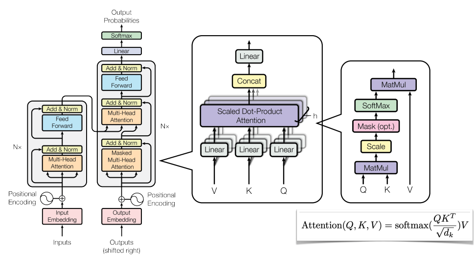

### ViT4Brain
This project utilize Vision <a href='https://arxiv.org/abs/2010.11929'>Transformer(ViT)</a> to classify Alzheimer’s disease (normal and AD) of the <a href='http://adni.loni.usc.edu/'>ADNI brain data</a>.

The input image will first be splitted into fixed-size pactches, with posional embeddings obtained by linear projection. And then, the patches will be fed into transformer encoder, afther that a multilayer perceptron(MLP) will handle the output to perfrom final clssification.
</img>


The original idea of <a href='https://proceedings.neurips.cc/paper/2017/file/3f5ee243547dee91fbd053c1c4a845aa-Paper.pdf'>transfomer</a> can be illustrated as follow, it utilizes multi-headed self-attention which can handle sequence data effectively by focusing on a certain part of the input.
</img>

### Data preparation
Put the unzipped preprocessed image files in the `datasets` folder. The path of the dataset is supposed to be like `./datasets/AD_NC/train/AD`

***Preprecessing***

***Training/Validation/Testing Set Spliting***
### Required Dependencies:

* Python 3.6+
* torch==1.11.0
* torchvision==0.12.0
* tensorboard==2.9.1
* pandas==1.4.2
* nump==1.21.5


### Usage
```bash
usage: main.py [-h] [--batch_size BATCH_SIZE] [--dim DIM] 
                [--lr LR] [--depth DEPTH][--heads HEADS] [--epochs EPOCHS] [--mlp_dim MLP_DIM]

optional arguments:
  -h, --help            show this help message and exit
  --batch_size BATCH_SIZE
                        batch size
  --dim DIM             neural network dimension
  --lr LR               learning rate of the optimizer
  --depth DEPTH         depth of the network
  --heads HEADS         number of heads in the multihead attention
  --epochs EPOCHS       number of epochs to train
  --mlp_dim MLP_DIM     dimension of the mlp on top of the attention block
```

### Results

### More file description**:
* initialization_converage.py includes the implementation of coverage driven initialization.
* utility.py includes a set of helper functions.
* intermediate_files folder includes some useful intermediate_files for fast replication.
* testbeds and datasets folder includes the raw file of all datasets.
