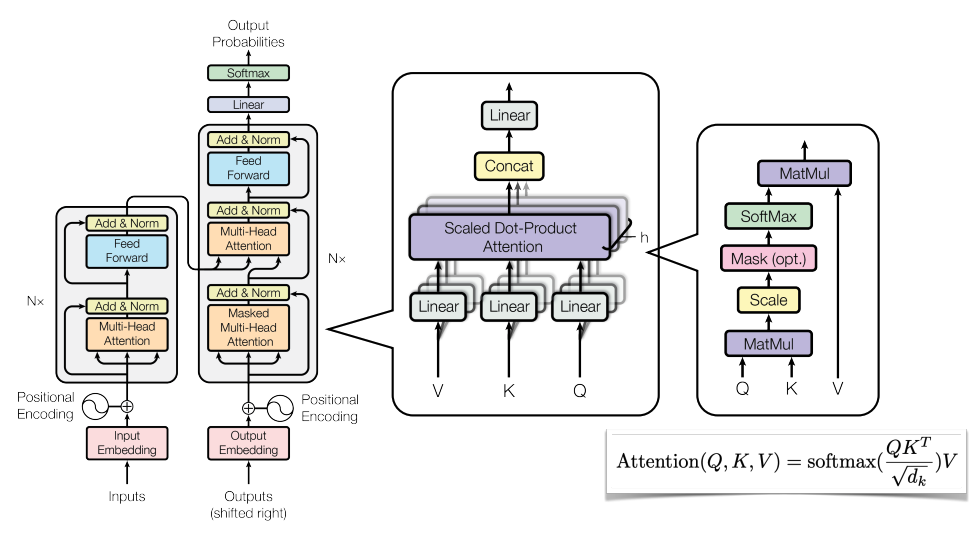
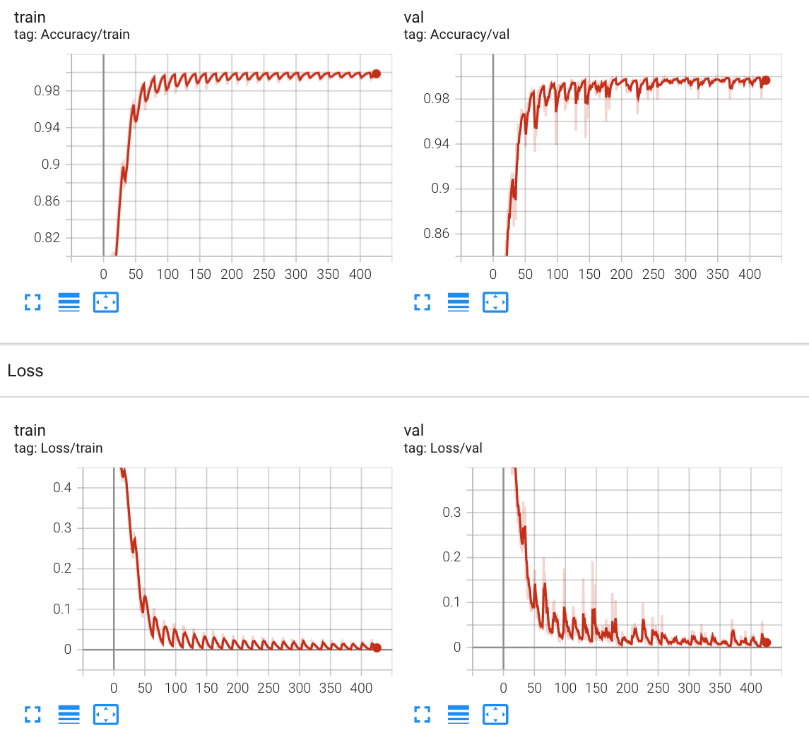

### ViT4Brain

### Problem definition

This project utilize Vision <a href='https://arxiv.org/abs/2010.11929'>Transformer(ViT)</a> to classify Alzheimer’s disease (normal and AD) of the <a href='http://adni.loni.usc.edu/'>ADNI brain data</a>. The model will take the ANDI images as input and predict whether they belongs to AD or NC.

### Model exaplaination

The input image will first be splitted into fixed-size pactches, with posional embeddings obtained by linear projection. And then, the patches will be fed into transformer encoder, afther that a multilayer perceptron(MLP) will handle the output to perfrom final clssification.

</img>


The original idea of <a href='https://proceedings.neurips.cc/paper/2017/file/3f5ee243547dee91fbd053c1c4a845aa-Paper.pdf'>transfomer</a> can be illustrated as follow, it utilizes multi-headed self-attention which can handle sequence data effectively by focusing on a certain part of the input.


</img>

(The images are from the original paper.)

### Data preparation
Put the unzipped preprocessed image files in the `datasets` folder. The path of the dataset is supposed to be like `./datasets/AD_NC/train/AD`


***Training/Validation/Testing Set Spliting***

Please note that  people from the same ID would only appear in either the train or validation set during training.

* The test images follows the original download file folder struture.
* There are 10400 AD images and 11120 NC images in the train folder. 
* The original train images further split into into train and validation sets, using approximatly 20% of the images for validation.
* The junction datapoints where training and validation set splitting is manualy checked , to make sure not cover one patient's images in both sets.

***Preprecessing***

The training image will be resized to 224 * 224 size, and then  trasformed with data augumentation. The valid and test images will be resized to 224 * 224 size.
### Required Dependencies:

* Python 3.6+
* torch==1.11.0
* torchvision==0.12.0
* tensorboard==2.9.1
* pandas==1.4.2
* numpy==1.21.5


### Usage
```bash
usage: main.py [-h] [--batch_size BATCH_SIZE] [--dim DIM] 
                [--lr LR] [--depth DEPTH][--heads HEADS] [--epochs EPOCHS] [--mlp_dim MLP_DIM]

optional arguments:
  -h, --help            show this help message and exit
  --batch_size BATCH_SIZE
                        batch size
  --dim DIM             neural network dimension
  --lr LR               learning rate of the optimizer
  --depth DEPTH         depth of the network
  --heads HEADS         number of heads in the multihead attention
  --epochs EPOCHS       number of epochs to train
  --mlp_dim MLP_DIM     dimension of the mlp on top of the attention block
```

Example scripts:
```bash
python main.py --mode=train --model=ViT --depth=8 --mlp_dim=1024
python main.py --mode=test
python main.py --mode=pred
```

### Results
Use below script to see the result loged by tensorboard at http://localhost:6008/.
```
tensorboard --logdir=./runs   
```
The plot of loss and accuracy during training and validation can been seen as follow:

</img>

Unfortunately even the accuracy of training and validation is apporaching to 100%, the testing accuracy is only **$0.643$**. The first thought came to my mind is overfitting. However, to reduce the influence of overfittly as much as possible, data augmentation and dropout has been considered. For data augmentation, RandomHorizontalFlip, RandomVerticalFlip, and RandomRotation have been used. And the model is trained with setting dropout = $0.2$.

### Better accuracy using existing pacakge
A variant of ViT, <a href ='https://arxiv.org/abs/2203.15380'>SepVit</a> ,has been tried and finally got above **$0.758$** accuracy. The innovation of this model is using depthwise-pointwise self-attention.
By using package from https://github.com/lucidrains/vit-pytorch, fistly  'pip install vit-pytorch'. And use pretrained model from https://drive.google.com/file/d/1EZY9jvK5CnMFLIfqHZsuY9gZX5ERbQL7/view?usp=sharing , and put it in the same folder with main.py.
Below script can be used and the higher accuracy **$0.758$** can be obtained.
```
python main.py --mode=test --model=SepViT
```

### More file description:
* main.py: hyperparameter initilization, loading dataset, model construction, the train/valid/test process.
* train.py: train/test/valid function.
* predict.py: predict several samples from the test set.
* module.py: model structure of ViT.
* './images': images used in the README
* './runs': training loss and accuracy report. 

