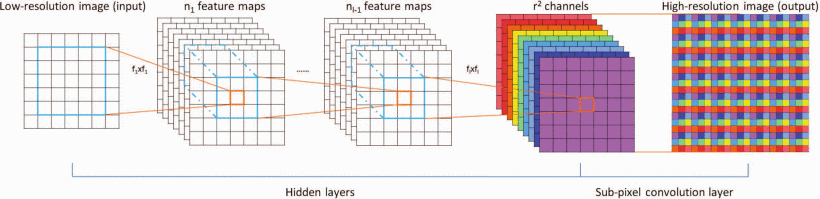
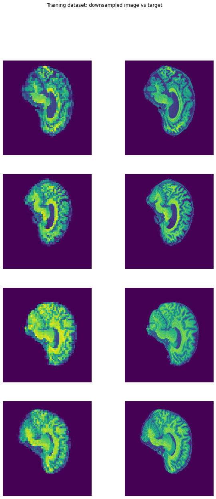
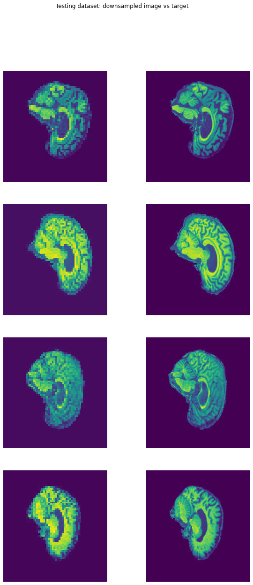
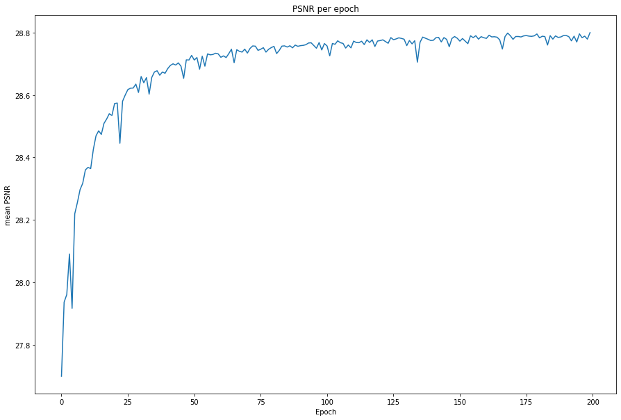
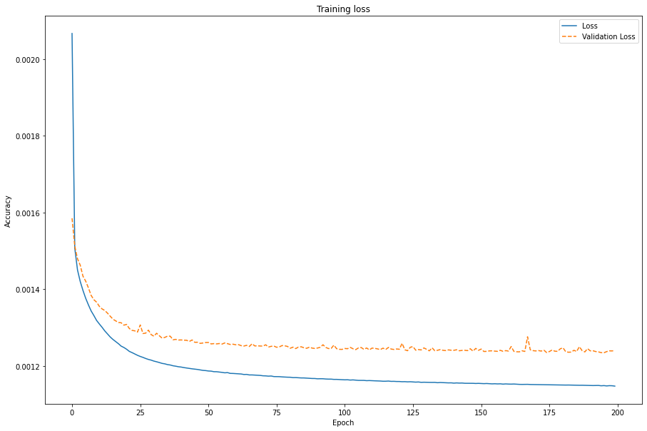
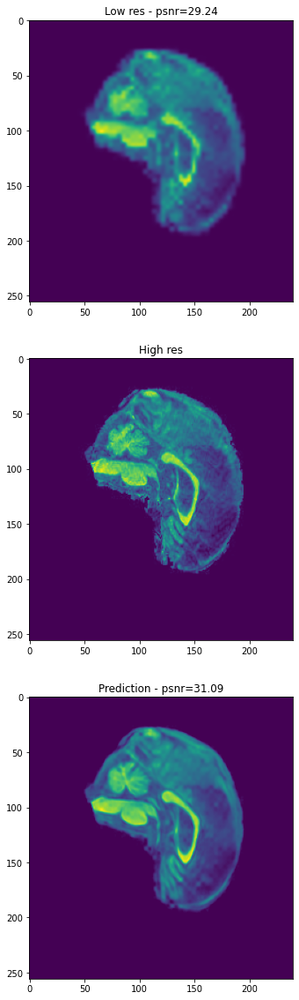
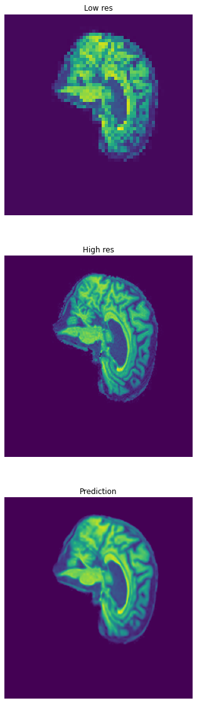
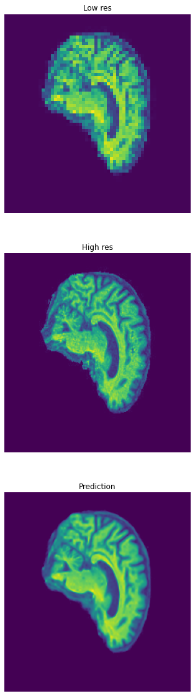

# Super Resolution CNN

_Author_: Sam Lucena | 46416001

COMP3710, The University of Queensland, October 2022

## Algorithm Description
This algorithm is a super-resolution convolutional neural network. It takes as 
input a downscaled or small image and produces an upscaled image. It works on
ADNI-MRI brain scan data.

This differs from earlier algorithms as often these take images that have been
reshaped to the final size. This leads to increased computational requirements
for no larger benefit. Taking the low-resolution image as input greatly improves
the computational performance.

### Problem That it Solves
Super-resolution imaging has applications in many areas of imaging, including 
medical imaging and facial recognition [^1]. The proposed algorithm is used to 
upscale MRI images, which could have benefits in medical fields to lower the 
required resolution of MRI scans, allowing for more patients to access the 
technology.

### How it Works
Figure 1 outlines the structure of the algorithm/model used. My implementation 
added an extra convolutional layer to improve output quality.

_Figure 1_: Map of the SPCNN [^1]

The algorithm deconstructs the low-res input to a feature map (convolutional 
layer) and uses this feature map to reconstruct the image into a larger 
resolution. 

The training and test images are downscaled to 1/4 of their original resolution 
using a gaussian filter. These datasets are input to the model for training, 
with the target of each image being the same image in its original resolution. 
The model will then output an image that has been resized back to the original 
resolution.

The model used has the following structure:
1. Input of shape [64, 60, 1] (1/4 size ADNI-MRI images)
2. Convolutional layer with 64 filters and a kernel size of 5
3. Convolutional layer with 128 filters and a kernel size of 3
4. Another convolutional layer with 128 filters and a kernel size of 3
5. Convolutional layer with 16 filters and a kernel size of 3
6. Output `depth_to_space` layer that maps to the final [256, 240, 1] shape

## Example Usage
### Dependencies
This model was created using:
- python 3.10
- tensorflow 2.9.1
- matplotlib 3.5.3

There should not be any issue reproducing the results and there is no 
functionality that requires specific versions of the above requirements. 

Final testing was done over 200 epochs which took about 75 minutes on a RTX 
3060 graphics card.

### Inputs
The image datasets used for training and testing are automatically retrieved 
from blackboard and downloaded locally [^2]. Figures 2 and 3 give examples from
these datasets:

_Figure 2_: Training dataset (downscaled vs original)

_Figure 3_: Testing dataset (downscaled vs original)

### Training the model
To train the model, `run_model()` in `train.py` must be executed. The only 
input to this function is the number of epochs to train for.

This function will download the data, load it into datasets, perform training,
and plot some example predictions and results.

### Using the Trained Model
To see the output of the trained model, use `predict.display_prediction`, 
inputting a low-resolution image (shape 64, 60, 1) and the model. This will
output a plot similar to figures 6, 7, and 8.

## Data
### Preprocessing
The training and testing datasets have been pre-processed by the course 
teaching team to allow for easy data loading. 

### Data splits
The data given from the course is pre-split into training and testing. I kept 
these provided splits, using the training data as validation during each epoch.

## Results
To track the accuracy of the model, PSNR is used to compare the output image 
against the high resolution image. Figure 4 shows that over 200 epochs of 
training, the psnr comparison rose to a steady value just below 28.8. 

_Figure 4_: PSNR performance

As shown in Figure 5, the loss of the model also steadily decreased with 
continued training over 200 epochs. 

_Figure 5_: Loss per epoch

Figures 6, 7, and 8 show the results of 200 epochs of training. These images 
are from the testing dataset.

_Figure 6_: Prediction 1

_Figure 7_: Prediction 2

_Figure 8_: Prediction 3

# References

[^1]: W. Shi _et al._, "Real-Time Single Image and Video Super-Resolution Using 
an Efficient Sub-Pixel Convolutional Neural Network," _2016 IEEE Conference on_ 
_Computer Vision and Pattern Recognition (CVPR)_, 2016, pp. 1874-1883, doi: 
10.1109/CVPR.2016.207.

[^2]: https://cloudstor.aarnet.edu.au/plus/s/L6bbssKhUoUdTSI

_Model is based on_: 
https://keras.io/examples/vision/super_resolution_sub_pixel/