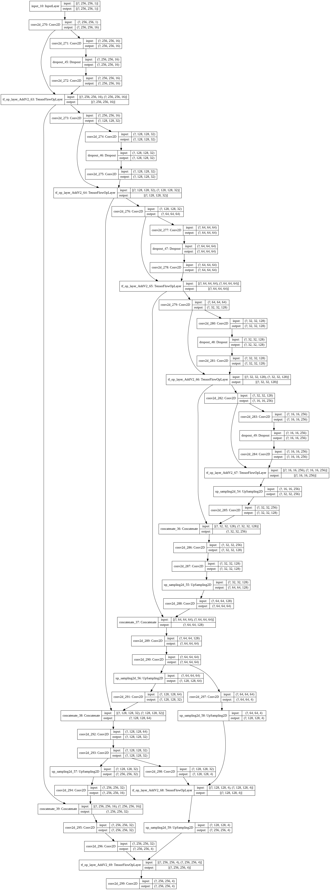
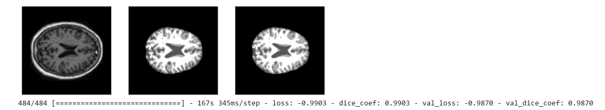

"Author" 
Zhifang Zheng(45788167)

Pattern Recognition
==============================================================================================

Description
--------------------------------------------------------------------------------------------------

This report illustrates how to train a U-Net for OASIS brain tumor segmentation, using a minimum   
Dice similarity coefficient of 0.9 on the test dataset. The data is consist of MR images  
of the 300+ human brains with accompanying segmentations, which we need to download from Cloidstore   
with the link 'https://cloudstor.aarnet.edu.au/plus/s/n5aZ4XX1WBKp6HZ/download'.  

There are 2 script files, a README.md file, and one image file( final results and model_summary) under the test file.
The root is, on the top-recognition branch in github, "PatternFlow/recognition/test/..."

Environment
--------------------------------------------------------------------------------------------------

*tensorflow version: 2.3.0    
*python version: 3.7.9

Alogrithm  
--------------------------------------------------------------------------------------------------

* Unet_Model: Depending on the U-Net architecure, we designed the network to process large 2D input block of 256 * 256 voxsels.  
	*Parameters:
	- out_channel: 4
	- input_data: tensor.shape(256, 256, 1)
	- activation: 
	  -LealyRelu(alpha=0.01): It fixes the “dying ReLU” problem, as it doesn’t have zero-slope parts.   
	  -softmax: It converts the scores to a normalized probability distribution.
	- epochs: 20  
	- train_ds.batch: 20  
	- val_ds.batch: 20

   *Loss Function: Dice coefficient is used for comparing the similarity of  two batch of data (especially for binary image    
   	segmentation). The coefficient between 0 to 1, 1 means totally match.  Based on the matric of dice coefffient, we can   
   	evaluate the dice loss.  
    - dice_coef: metrics=[(2. * intersection + smooth) / (K.sum(train_ds_f) + K.sum(test_ds_f) + smooth)]  
	- dice_coef_loss:  loss=dice_coef_loss   
## Model flow  chart ( the process of building the model)
      

Visualization (Prediction) 
--------------------------------------------------------------------------------------------------

The prediction on brain segmentation is around 0.99, which denotes perfect and complete overlap. 

