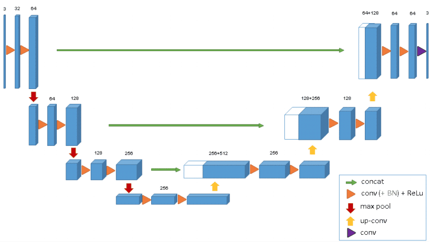
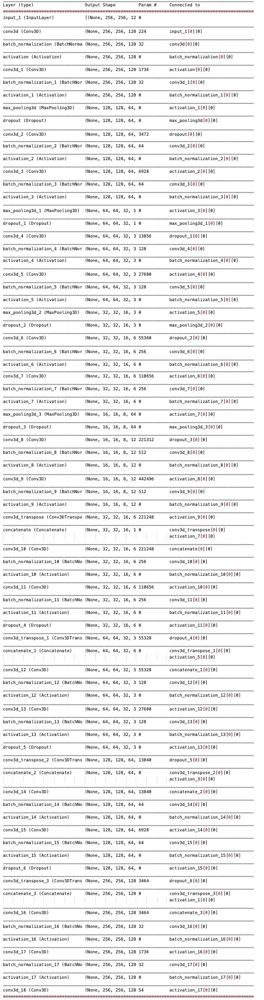
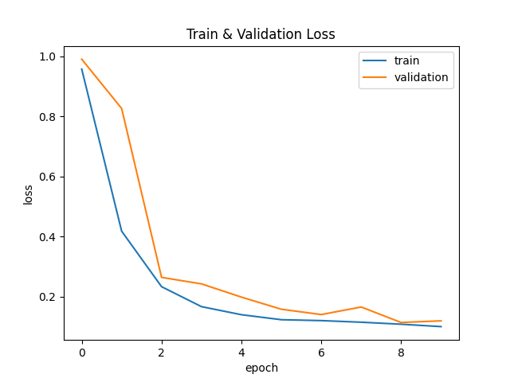
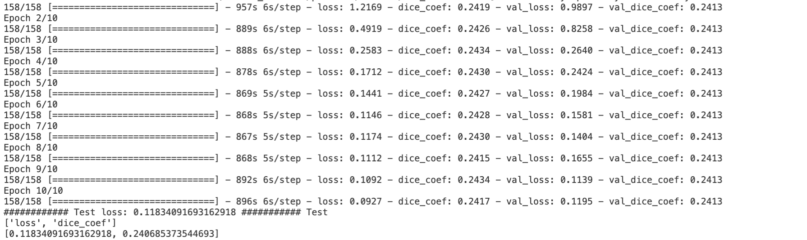
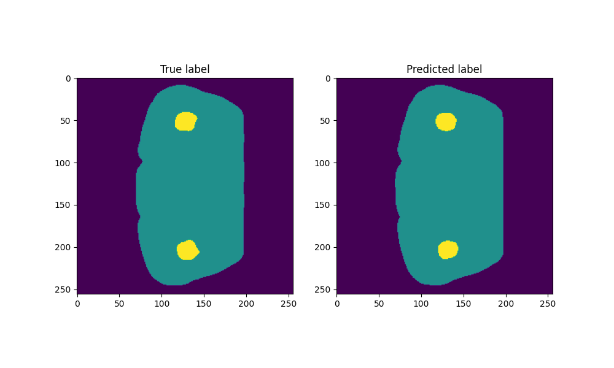
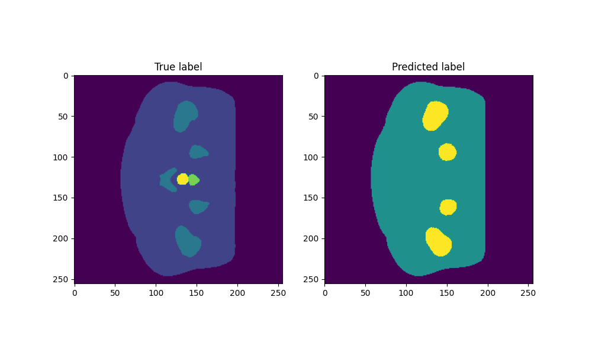
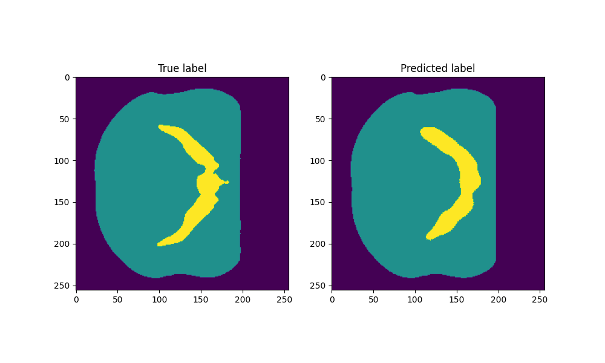

## Name: Xiaofang Chen
## Student Number: 46046408 <br/><br/>
# 3D-Prostate image Segmentation Using UNet3D 
## Algorithm description 

Similar to Unet2D, UNet3D has the typical Encoder and Decoder schema. The Encoder (left side) consists of several convolutional blocks: in each block there are two 3x3x3 Convolutions each followd by batch normalization and Relu activation. Then a max pool operation with size 2x2x2 is applied to reduce image size. Next is the Decoder (right side). At each step, feature maps are upsamepled by a 3x3 transpose convolution, and then concatenated with the corresponding feature map from the Encoder. After that a double-convolution operation that has happended in Encoder are applied again. Finally, at output layer a 1x1 Convolution maps the depth of output to number of target classes.  

 
<br/>[img refernce]( https://theaisummer.com/unet-architectures/)


## 3D Semantic image segmentation problem
This project aims to segment the 3D Prostate dataset with labels. More specifially, it is a pixel-wise classification which classify each pixel in an 3D MRIs into the correct class. In this project, the dataset chosen has 6 classes.

## Procedure
#### 1. Data Preparation:
 * Data processing: Includes image resize, scale, reshape and augmenatation;
 * Data generation: customized data generators for 3D images and implement train-val-test split method on patient basis (if one paticient has more than two-week's of records, the method ensures allocating imgs of the paticient to each set).
#### 2. Model configuration
   * optimizer: Adam with learning rate 0.001); 
   * loss function: sparse_categorical_crossentropy
   * evaluate metric: dice coeficient
#### 3. Model summary


## Dependencies 
1. Dataset is downloaded from https://data.csi.  Unzip the downloaded data and reassign as followed.

```bash
unet3d (project folder)
    |_datasets
        |_semantic_MRs_anon
            |_ Case_004_Week0_LFOV.nii.gz
            |_ Case_004_Week1_LFOV.nii.gz
            |_ ...
        |_semantic_labels_anon
            |_ Case_004_Week0_SEMANTIC_LFOV.nii.gz
            |_ Case_004_Week1_SEMANTIC_LFOV.nii.gz
            |_ ...
```
2. Notice that code for image resize only need to be ran once and resized image will be saved to replace.
3. The project is built on following dependencies:
* python3.9
* tensorflow 2.4.1
* matplotlib 3.4.3
* nibabel 3.2.1
## Results
### Train & Validation Loss Curve


### The average dice coefficient of test result is only 2.4.

## Compare predictions with labels
#### The 33th slice

#### The 65th slice

#### The 128th slice



