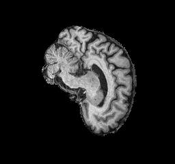
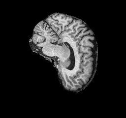

# Section Navigation
1. [Description of Algorithm](#description-of-algorithm)
2. [Problem It Solves](#problem-it-solves)
3. [How It Works](#how-it-works)
4. [Figure/Visualization](#figure--visualizaton)
5. [Dependencies](#dependencies)
6. [Reproducibility of Results](#reproducibility-of-results)
7. [Example Inputs/Outputs](#example-inputs--outputs)
8. [Plot of Algorithm](#plot-of-algorithm)
9. [Pre-processing](#pre-processing)
   - Preventing Data Leakage
   - Cropping to Improve Computational Efficiency
   - Expanding the Dataset with Augmentation
10. [Training and Validation Splits](#training--validation-splits)
11. [References](#references)


# Vision Transformer for ADNI Images

#description-of-algorithm
## Description of Algorithm


This is an implemention of a Vision Transformer (ViT) which follows as closely as possible the model presented by Dosovitskiy et al $^1$ in their 2021 paper *An Image is Worth 16x16 Words: Transformers For Image Recognition at Scale*.     


(Image Reference)

This implemenaton of a ViT has been tailored for use with data from the Alzheimer's Disease Neuroimaging Initiative (ADNI).  This data was provided on the COMP3710 Blackboard site in a zip format.  It is unknown as to what extent this data matches that available directly from ADNI.

The ADNI images are 240x256 greyscale jpeg files.  Details on image pre-processing and image directory structure can be found in Pre-processing.  

*Stage 1: Create Embedding Vectors from Input Images*

The ViT takes as input a sequence 1D arrays, each of which is a flattened "patch" extracted from an image.  For example, a 240 x 240 image with a patch size of 16 would create 15 x 15 = 225 patches each having a length of 256 once flattened.  Each of the flattened patches is then mapped onto *D* dimensions (the projection dimensions).  These projections are referred to as the patch embeddings.

A class token of the same dimensions as the flattened patches is then prepended to the patch embeddings.  Continuing with the example from above there would now be 226 1D inputs (225 flattened patches plus the class token).  

The final step in creating the embedding vectors is to add a position embedding to the patch embeddings.  The embedding vectors are now ready for input into the Transformer Encoder.

*Stage 2: Learn Spatial Relations Between Patches with Transformer Encoder*

The embedding vectors are now passed through one or more layers of the Transformer Encoder.  Each layer of the transformer encoder is constructed from two blocks.  The first block consists of layer normalization followed by multi-head self attention, and the second block consists of layer normalization followed by a multilayer perceptron.  For each block a residual connection is applied.

*Stage 2: Classify with a Multilayer Perceptron using the Class Token*

The class token is now extracted from the Transformer Encoder output and fed into a multilayer perceptron("The MLP Head") which consists of two or more hidden layers.  The output of the MLP Head is used to predict the sample classification.

[Back to Top](#section-navigation)
# Problem it Solves


CNNs are local, self-attention is global

[Back to Top](#section-navigation)
# How it Works

1. Download and unzip data 
2. Create environment
3. Prepare the data 
   - Create new folder structure
   - Create validation and training from train to preclude leakage
   - Augment?
   - Crop the images
4. Update config.py
5. run python train.py
6. Load model weights and make predictions by running python predict.py 

[Back to Top](#section-navigation)
# Figure / Visualizaton

- training loss and accuracy (best, anomolies)
  - validation accuracy above training accuracy
  - good loss / accuracy plot, terrible test results
  - stagnation
  - sgd vs adam for same parameters
- table of experiments

- 


 
[Back to Top](#section-navigation)
# Dependencies

### Image Preprocessing
- augmentor
- python 10

### ViT
- python 3.9
- matplotlib
- tensorflow 2.9
- numpy
- keras_cv
- tensorflow_addons

[Back to Top](#section-navigation)
# Reproducibility of Results
- initial selection of validation set
- seed in image_dataset_from_directory
- hyperparams --> obviously stochastic by nature

[Back to Top](#section-navigation)
# Example inputs / outputs
- input: brain image?
- output: test results?

[Back to Top](#section-navigation)
# Plot of Algorithm
- training loss and accuracy?

[Back to Top](#section-navigation)
# Pre-processing
1. create folders
2. prevent leakage
3. crop
4. augment


The ADNI images are received in a zip format.  Extracted images are placed in the following file structure:

```bash
├───test
│   ├───AD
│   └───NC
├───train
│   ├───AD
│   └───NC
```

The test set contains 9000 images of which 4460 are AD and 4540 are NC.  The training set contains 19360 images, of which 9360 are AD and 10000 are NC.  

Here is image "218391_78.jpeg" from the AD folder:



Here is image "839474_78.jpeg" from the NC folder:



The files names appear to be formatted such that the numbers separated by "_" has some significance.  An assumption can be made that the first number is a patient ID and the second number is an image ID for this patient.  This assumption is supported by the fact that each ID is associated with 20 images.  Thus the 9360 training images for class "AD" contain images from 468 unique patients.

#### Potential for Data Leakage

This insight into the provenance of the filename has important implications for the selection of a method to generate a validation set.  If patient IDs are not taken into consideration and validation images are selected at random from the training set, then it would be possible for the images of one or more patients to appear in both the training and validation ("data leakage").  Thus a python script was created to generate the validation set taking into account the patient ID so that no images for any single patient are found in both the training and validation set.  

#### Additional Observations Regarding Images

Three additional observations regarding the images have implications for our pre-processing.  The first is that the images have the shape 256 x 240 (w x h).  The vision transformer requires square images from which to make patches so each image will need to be cropped.  Furthermore we can see that there is lots of empty space around each brain image.  Assuming the empty space will not play a role in classification performance, we can crop the images to a smaller size.  The benefit to the model is computational - for the same patch size, fewer patches will need to be processed for each image.  However, the brains will have variation in size and relative position on the image so care must be taken to select the minimum size that will reliably capture all brain images.  After some tinkering, an image size of 200 x 200 was found to significantly reduce empty space while also ensuring no brains were cropped.

#### Mitigating The Impact of Dataset Size on ViT Performance


This is a grayscale image with the dimensions 256 x 240.   
- lots of empty space
- orientation
- brightness
- 


[Back to Top](#section-navigation)
# Training & Validation Splits


[Back to Top](#section-navigation)
# References

$^1$ An Image is Worth 16x16 Words: Transformers For Image Recognition at Scale

$^2$ https://adni.loni.usc.edu/

$n_{1}$

[Back to Top](#section-navigation)

To do:

footnotes? 

[^2].

[^2]: 

model summary from tensorflow

