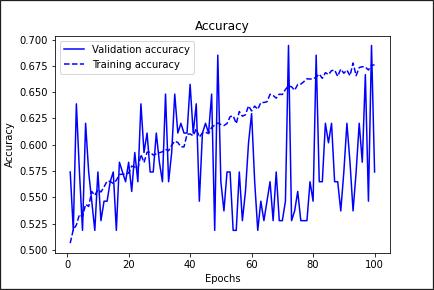

# Section Navigation
1. [Description of the Algorithm](#description-of-the-algorithm)
2. [Problem It Solves](#problem-it-solves)
3. [How It Works](#how-it-works)
4. [Image Pre-processing](#image-pre-processing)
5. [Experiments & Results](#experiments-and-results)
6. [Dependencies](#dependencies)
7. [Reproducibility of Results](#reproducibility-of-results)
8. [Training and Validation Splits](#training--validation-splits)
9. [References](#references)


# Vision Transformer for ADNI Images

# Description of the Algorithm

This is an implemention of a Vision Transformer (ViT) which follows as closely as possible the model presented by Dosovitskiy et al $^1$ in their 2021 paper *An Image is Worth 16x16 Words: Transformers For Image Recognition at Scale*.     


Image from *An Image is Worth 16x16 Words*

This implemenaton of a ViT has been tailored for use with data from the Alzheimer's Disease Neuroimaging Initiative (ADNI).  This data was provided on the COMP3710 Blackboard site in a zip format.  It is unknown as to what extent this data matches that available directly from ADNI.

The ADNI images are 240x256 greyscale jpeg files.  Details on image pre-processing and image directory structure can be found in the [Image Pre-processing](#image-pre-processing) section.  

*ViT Stage 1: Create Embedding Vectors from Input Images*

The ViT takes as input a sequence of 1D arrays, each of which is a flattened "patch" extracted from an image.  For example, a 240 x 240 image with a patch size of 16 would create 15 x 15 = 225 patches each having a length of 256 once flattened.  Each of the flattened patches is then mapped onto *D* dimensions (the projection dimensions).  These projections are referred to as the patch embeddings.

A class token of the same dimensions as the flattened patches is then prepended to the patch embeddings.  Continuing with the example from above there would now be 226 1D inputs (225 flattened patches plus the class token).  

The final step in creating the embedding vectors is to add a position embedding to the patch embeddings.  The embedding vectors are now ready for input into the Transformer Encoder.

*Stage 2: Learn Spatial Relations Between Patches with Transformer Encoder*

The embedding vectors are now passed through one or more layers of the Transformer Encoder.  Each layer of the transformer encoder is constructed from two blocks.  The first block consists of layer normalization followed by multi-head self attention, and the second block consists of layer normalization followed by a multilayer perceptron.  For each block a residual connection is applied.

*Stage 2: Classify with a Multilayer Perceptron using the Class Token*

The class token is now extracted from the Transformer Encoder output and fed into a multilayer perceptron("The MLP Head") which consists of two or more hidden layers.  The output of the MLP Head is used to predict the sample classification.

[Back to Top](#section-navigation)
# Problem it Solves

 Since their introduction in 2017 $^3$ self-attention based transformers have  been the model of choice for state of the art natural language processing.  At the same time, convolutional neural networks have dominated computer vision and image classification.  The use of vision transformers in image classification is an opportunity to extend the success of attention based transformers into the domain of computer vision.  Such an extension is enticing due to the computational efficiencies and scalabilities that transformers provide. Dosovitskiy et al's paper was groundbreaking in that it demonstrated that self-attention based transformer architectures could compete with state of the art convolution based architectures in many image recognition tasks. $^1$

One reason why CNNs are so successful at image recognition is their ability to identify features in the images that are translation invariant.  The inductive bias of the CNN architecture promotes both identification of these features and their assembly into a hierarchical structure.  In contrast, attention transformers have been successful due to their ability to provide global context.  For example, the word "bank" has several different meanings depending on the context in which it is used, and transformers are proficient at identifying this context.  It is therefore significant that the contextual approach (eg attention based transformers) has been found to be successful in image recognition where hierarchical feature maps have been dominate.

This Vision Transformer implementaion attempts to solve the problem of Alzheimer's Disease diagnoses using a 2D image of a patient's brain.  Alzheimer's Disease is a neurological disorder that affects tens of millions of people worldwide and its early detection is critical to mitigating the adverse impacts of the disease on patients and their families. $^4$ 

[Back to Top](#section-navigation)

---

# How it Works
The key steps for creating the ViT and using it with the ADNI data are:  

1. **Download and unzip data** 
2. **Create environment**
3. **Image Pre-processing - utils.py** 
4. **Update Hyperparamaters - config.py**
5. **Train Model - train.py**
6. **Load Model Weights and Make a Prediction on a Random Sample - predict.py** 

Each of the steps above is now reviewed in more detail.

#### 1. <u>Download and unzip data</u>

The ADNI images are received in a zip format.  Once extracted, the images are placed in the following file structure:

```bash
├───ADNI_AD_NC_2D
│   └───AD_NC
│       ├───test
│       │   ├───AD
│       │   └───NC
│       └───train
│           ├───AD
│           └───NC

```
It is of the uptmost importance that the AD_NC folder above (and its images) be relocated to the project directory.  The scripts for directory creation, validation split, image cropping, and image augmentation will only work if this is done.

Once the AD_NC folder has been relocated to the project folder the structure should look like this:


```bash
├───vit-transformer-s4630996
│   ├───AD_NC
│   │   ├───test
│   │   │   ├───AD
│   │   │   └───NC
│   │   └───train
│   │       ├───AD
│   │       └───NC
│   ├───images
│   └───__pycache__
```
The training set contains 19360 images, of which 9360 are AD (classified Alzheimers) and 10000 are NC (classified normal cognition).  The test set contains 9000 images of which 4460 are AD  and 4540 are NC.  

#### 2. <u>Create environment</u>

It is necessary to create two different environnments, one for image pre-processing and another for the Vision Transformer.  The two environments are recommended due to conflicts in dependencies that could exist between the Augmentor package and other Python image modules.  Augmentor uses Pillow, which is a fork of PIL, but both packages cannot exist simultaneously.

The ViT is developed in a Tensorflow environment.  Tensorflow 2.9 is recommended for compatibility with Tensorflow Add Ons and Keras CV.  For installation of the Tensorflow environment it is strongly recommended to use a Windows 11 based PC with a modern GPU and follow the guidance available here:

https://github.com/jeffheaton/t81_558_deep_learning/blob/master/install/manual_setup2.ipynb

A listing of required modules is provided below in [*Dependencies*](#dependencies).


#### 3. <u>Image Pre-processing</u>

The amount of image pre-processing is extensive and as a result it has been given its own section below or linked here [Image Pre-processing](#image-pre-processing).  


#### 4. <u>Update config.py</u>

The Python file config.py provides a single location for model hyperparameters to be modified.  Variables contained in config.py are imported into the Python modules where they are required.  Any modifications to the base model (such as a change in optimzer, change of model checkpoint path, etc.), may require the addition of new hyperparameters.

For ease of identification all hyperparameters are capitalized.


#### 5. <u>Train Model</u>

The model can be trained by running "python train.py" from the Anaconda (or teminal) prompt.  Although this step appears simple there are a few things to remember to ensure this will work:
- Ensure python is on your PATH variable 
- Verify your Python 3 alias - for example if your Python alias is python3 then you would run "python3 train.py 
- Ensure you are running the command from the folder "VIT-TRANSFORMER-S4630996" (this is where train.py is located)
- Ensure the correct environment you created for the ViT has been activated

At the end of each epoch, the model is evaluated against the validation set and a checkpoint callback saves weights for the model with the lowest validation loss.  These model weights can be loaded and used to predict the classification of new data points (See next step, Load Model Weights and Make Predictions).


#### 6. <u>Load Model Weights and Make a Prediction on a Random Sample</u>

After step 5 above has been successfully completed the saved model weights can be loaded so that the model can be used in inference mode.  This can be done by running "python predict.py".  A single random sample from the ADNI test data is made and the image is displayed for the user.  After closing or saving the image the model makes a prediction for this sample and prints the results to the console.

It is important to note that predict.py takes a random sample from the cropped (eg square) ADNI test data. If a user wishes to provide other test data then predict.py will need to be modified accordingly.


[Back to Top](#section-navigation)

---

# Image Pre-processing

Image pre-processing consists of the following tasks:

   - Create required folders
   - Create Validation Set
   - Crop the images
   - Augment the images

All pre-processing tools are contained in utils.py.  This file contains the ADNI_dataset_utility class which possess the methods necessary to achieve the pre-processing steps.  As provided, utils.py is setup to perform all pre-processing steps at once by running "python utils.py".  This command should be run in the terminal from an active pre-processing environment (discsussed above) and in the same folder where utils.py exists.  

The instantiated ADNI_dataset_utility executes the following methods in this order: 
1) create_directories(), 
2) move_and_split_images(), 
3) crop_and_save_images(), and 
4) add_augmented_imges()

To customize which preprocessing steps are performed a user may enter utils.py and comment out one or more of the above steps, keeping in mind that doing may have implications for how and if the model runs.  At a minimum steps 1-3 need to be run in order but the addition of augmented images is optional.

Each of the above steps will now be briefly explained.

#### <u> Create required Folders</u>

The ADNI_dataset_utility method create_directories() will create three directories in the project folder from where it is run:
1) AD_NC_split (with subfolders)
2) checkpoint (to save model weights)
3) plots (to save plots of results)

#### <u> Create the Validation Set</u>

To understand the methodolgy for creating the validation set it is necessary to provide some background information on the images and their filenames.

Here is image "218391_78.jpeg" from the AD folder:


Here is image "839474_78.jpeg" from the NC folder:


The files names appear to be formatted such that the numbers separated by "_" have significance.  An assumption can be made that the first number is a patient ID and the second number is an image ID for this patient.  This assumption is supported by the fact that each ID is associated with 20 images.  Thus the 9360 training images for class "AD" contain images from 468 unique patients.

#### Potential for Data Leakage

This insight into the provenance of the filename has important implications for the selection of a method to generate a validation set.  If patient IDs are not taken into consideration and validation images are selected at random from the training set, then it would be possible for the images of one or more patients to appear in both the training and validation ("data leakage").  Thus a python script was created to generate the validation set taking into account the patient ID, so that no images for any single patient are found in both the training and validation set.  

The ADNI_dataset_utility method move_and_split_images() creates a new folder named "AD_NC_split that contains the following subfolders:

1) test
2) training
3) validation

The test folder contains the same test images from the original AD_NC/test folder.  The training folder contains those images from AD_NC/train that will be used for training and the validation folder contains those images from AD_NC/train that will be used for validation. 

#### <u> Crop the Images</u>

The ADNI images have dimensions of 256 x 240 (w x h).  The ViT needs square images as its input and it is therefore necessary to crop the original images.  The ADNI_dataset_utility method crop_and_save_images() images creates a new folder named "AD_NC_square" that contains the same sub-folders and images as AD_NC_split except that the images are cropped to 240 x 240 pixels.

Assuming the empty space will not play a role in classification performance, we can crop the images to a smaller size.  The benefit to the model is computational - for the same patch size, fewer patches will need to be processed for each image.  However, the brains will have variation in size and relative position on the image so care must be taken to select the minimum size that will reliably capture all brain images.  After some tinkering, an image size of 200 x 200 was found to significantly reduce empty space while also ensuring no brains were cropped.  However, the downside to this approach is that very little room is left to allow robust image augmentation (discussed below).  Thus the base code retains the 240 x 240 image size.

#### <u> Augment the Images</u>

Compared to other datasets used by Vision Transformers, the ADNI dataset is quite small.  Thus image augmentation was utilized in an attempt to improve training results.  

Two approaches are taken with image augmentation.  The first is augmentation within the model itself through the Keras layers RandomFlip, RandomRotation, RandomTranslation, RandomBrightness, and GaussianNoise.

The second approach involves artificially enlarging the dataset with augmented image augmentations.  The Python package Augmentor was used to add augmented images.  The hyperparameter NUM_AUG_SAMPLES is set at a default value of 10,000 which is the number of augmented images to be added to the training set.  Thus when the ADNI_dataset_utility method add_augmented_images is called, the additional images are added to existing AD_NC_square/training folder.

A sample image from the augmented dataset can be seen below.  Here the brain has been slightly rotated, skewed, and a patch of the image has been removed from a random location.


[Back to Top](#section-navigation)


# Experiments and Results

The image datasets tackled by [ $1$ ] include CIFAR-100 and Oxford Flowers-102.  These datasets are large and complex in that many possible labels exist for a single image in the dataset.  The models developed to classify these images were commensurately large and complex.  The smallest of these models (ViT-Base) has 86M trainable parameters and the largest (ViT Huge) has 632M parameters.  
 
Unfortunately the author of this project does not have the same computational resources as Google, Inc. and it was necessary to scale the model options down.  However, the ADNI labels are binary - the image is either classified AD or NC, and for this reason it was hoped that a large and complex model was not required.   That being said, the largest model tried here was by no means small (100M parameters).

Given the small size of the ADNI dataset, regularization and augmentation techniques were heavily relied upon.  These included dropout, rescaling, random flip, random rotate, random noise, and random brightness.

Test accuracy percentages reported are based on an evaluation against the test set using model weights saved for an epoch for which there was the lowest validation loss. 


### Example Small Model Results
|Optimizer|Learning Rate|Patch Size|Projection Dims| Encoder Heads/Layers | MLP Head Units | Params | 
| :---: | :---: |  :---: | :--:| :--: | :--: | :--:| 
| AdamW   |0.0005 | 16    | 80 | 4/8 | 320 |1.1M |


Test Accuracy: 59.68%

The smallest of the models achieves results on par with the largest model.  Here each patch is projected onto 80 dimensions.  The model appears to memorize the training set as training accuracy approaches 1.  However, after only a small number of training cycles the validation loss soars and it is clear the model is overfitting.  

### Example Medium Model Results
|Optimizer|Learning Rate|Patch Size|Projection Dims| Encoder Heads/Layers | MLP Head Units | Params | 
| :---: | :---: |  :---: | :--:| :--: | :--: | :--:| 
| SGD   |0.0005 | 16    | 256 | 6/8 | 1024 |15.1M |


Test Accuracy: 55.09%

The medium model achieves results that are little better than chance (50%).  An attempt to train this model using the AdamW optimizer was unsuccessful so a switch was made to Stochastic Gradient Descent.  Unfortunately, despite attempting a wide range of learning rates, the validation loss and accuracy using AdamW remained (essentially) stationary despite a prolonged (300 epochs) training period. 

It is also observed that the validation loss becomes increasingly erratic.  Validation accuracy, although somewhat less erratic, appears cyclically stationary.  It is unclear what dynamics are causing these  behaviours.


### Example Large Model Results
|Optimizer|Learning Rate|Patch Size|Projection Dims| Encoder Heads/Layers | MLP Head Units | Params | 
| :---: | :---: |  :---: | :--:| :--: | :--: | :--:| 
| SGD   |0.0005 | 14   | 768 | 6/6 | 3072 |101.9M |




Test Accuracy: 59.88%

Although shown here on a different x and y scale, the behavior for the large model seems similar to that of the medium model above. Training accuracy and loss steadily improve over time while validation results are erratic and inconsistent. 

Although some overtraining appears to occur after epoch 40, a repeat attempt to train the model for only forty epochs achieved similar results.


The results above represent just a small sample of the total number of experiements run. Although over 50 experiments in total were performed the results did not vary significantly.  No model seemed to outperform and results that did seem to be higher could not be repeated to obtain the same high result. 

A larger sample of the experiments performed is found below.


It should be noted that the accuracy results listed here are a few percentage points higher than those reported above for the small/medium/large models.  These results were obtained prior to identifying the data leakage issue when making the validation set by random draw (as discussed above in [Image Pre-processing](#image-pre-processing)).  After addressing the data-leakage problem, the higher test accuracy scores could not be replicated and there was very little variation in test accuracy results.

These results are dissapointing in consideration of the repeated and detailed reviews of [1], the amount of hyperparameter tuning attempted, and the numerous consulations with course TAs who could not identify any obvious error in the model construction.  

One theory as to why improved results are so difficult here is that the data is actually 3D but presented in a 2D fashion.  Each image appears to be a different "slice' of the brain (as indicated by the file name syntax of patientID_sliceNum).  For this reason a hybrid CNN - Vit model architecture might prove more effective.  One such model might aggregate each patients's slices into channels so that each observation is actually 20 slices for the same patient (the dataset contains 20 images for each patient ID). Convolutions could then be learned to reduce each patient's 3D data into a set of 20 features each of which could be input into the ViT as a patch.


 
[Back to Top](#section-navigation)

---

# Dependencies

Two sets of dependencies are required.  The first is for creating the image preprocessing environment and the second is for creating the ViT environment.

### Image Preprocessing
- augmentor
- python 10

### ViT
- python 3.9
- matplotlib
- tensorflow 2.9
- numpy 1.21.5
- keras_cv 0.3.3
- tensorflow_addons 0.18.0

[Back to Top](#section-navigation)

---

# Reproducibility of Results

The final results produced by the ViT are stochastic in nature and influenced by the following sources of randomness:

- The initial selection of a validation set
- Shuffling of dataset when data is loaded (keras.preprocessing.image_dataset_from_directory)
- Backpropogation and the stochastic gradient descent algorithm

The code includes generation of random seeds to remove stochasticity from the creation of the validation set and the shuffling of the input data.  

[Back to Top](#section-navigation)

---

# Training & Validation Splits

The ADNI data came pre-split into a test and training set.  A validation split of 10% of the training set was chosen.  This value was felt to be a good compromise between maximizing the data available for training and the ability to periodically assess the model's generalizability.


[Back to Top](#section-navigation)

---


# References

$^1$ Alexy Dosovitsky, Lucas Beyer, Alexander Kolesnikov, Dirk Weissenborn, Xiaohua Zhai, Thomas Unterthiner, Mostafa Dehghani, Matthias Minderer, Georg Heigold, Sylvain Gelly, Jakob Uzszkoreit, Neil Houlsby. *An Image is Worth 16x16 Words: Transformers For Image Recognition at Scale*, Google Research, Brain Team 2021. 
https://arxiv.org/abs/2010.11929


$^2$ https://adni.loni.usc.edu/

$^3$ Ashish Vaswania, Noam Shazeer, Niki Parmar, Jakob Uszkoreit, Llion Jones, Aidan N Gomez, Lukasz Kaiser, and Illia Polosukhin. *Attention is All You Need*. 2017.
https://arxiv.org/abs/1706.03762

$^4$ https://www.mayoclinic.org/diseases-conditions/alzheimers-disease/symptoms-causes/syc-20350447


[Back to Top](#section-navigation)
 
 ---