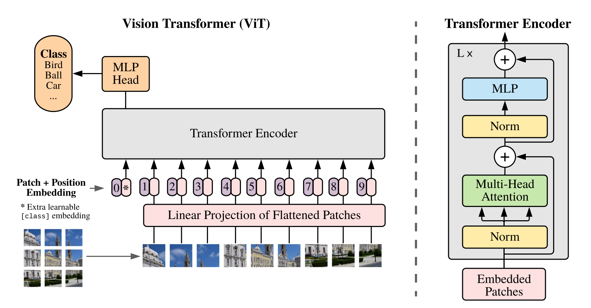

## Section Navigation
1. [Description of Algorithm](description-of-algorithm)
2. [References](#-references)

# Vision Transformer for ADNI Images

#description-of-algorithm
## Description of Algorithm

This is an implemention of a Vision Transformer (ViT) which follows as closely as possible the model presented by Dosovitskiy et al $^1$ in their 2021 paper *An Image is Worth 16x16 Words: Transformers For Image Recognition at Scale*.     

(Image Reference)

This implemenaton of a ViT has been tailored for use with data from the Alzheimer's Disease Neuroimaging Initiative (ADNI).  This data was provided on the COMP3710 Blackboard site in a zip format.  It is unknown as to what extent this data matches that available directly from ADNI.

The ADNI images are 240x256 greyscale jpeg files.  Details on image pre-processing and image directory structure can be found in Pre-processing.  

*Stage 1: Create Embedding Vectors from Input Images*

The ViT takes as input a sequence 1D arrays, each of which is a flattened "patch" extracted from an image.  For example, a 240 x 240 image with a patch size of 16 would create 15 x 15 = 225 patches each having a length of 256 once flattened.  Each of the flattened patches is then mapped onto *D* dimensions (the projection dimensions).  These projections are referred to as the patch embeddings.

A class token of the same dimensions as the flattened patches is then prepended to the patch embeddings.  Continuing with the example from above there would now be 226 1D inputs (225 flattened patches plus the class token).  

The final step in creating the embedding vectors is to add a position embedding to the patch embeddings.  The embedding vectors are now ready for input into the Transformer Encoder.

*Stage 2: Learn Spatial Relations Between Patches with Transformer Encoder*

The embedding vectors are now passed through one or more layers of the Transformer Encoder.  Each layer of the transformer encoder is constructed from two blocks.  The first block consists of layer normalization followed by multi-head self attention, and the second block consists of layer normalization followed by a multilayer perceptron.  For each block a residual connection is applied.

*Stage 2: Classify with a Multilayer Perceptron using the Class Token*

The class token is now extracted from the Transformer Encoder output and fed into a multilayer perceptron("The MLP Head") which consists of two or more hidden layers.  The output of the MLP Head is used to predict the sample classification.

## Problem it Solves

CNNs are local, self-attention is global

## How it Works

1. Download and unzip data 
2. Create environment
3. Prepare the data 
   - Create new folder structure
   - Create validation and training from train to preclude leakage
   - Augment?
   - Crop the images
4. Update config.py
5. run python train.py
6. Load model weights and make predictions by running python predict.py 

## Figure / Visualizaton

- training loss and accuracy (best, anomolies)
- table of experiments
- vit Model (in algorithm description)
- 

## Dependencies

python 3.9
matplotlib
tensorflow 2.9
numpy
keras_cv
tensorflow_addons

## Reproducibility of Results
- initial selection of validation set
- seed in image_dataset_from_directory
- hyperparams --> obviously stochastic by nature

## Example inputs / outputs
- input: brain image?
- output: test results?

## Plot of Algorithm
- training loss and accuracy?

## Pre-processing
1. create folders
2. prevent leakage
3. crop
4. augment

## Training & Validation Splits

# References

$^1$ An Image is Worth 16x16 Words: Transformers For Image Recognition at Scale

$^2$ https://adni.loni.usc.edu/

$n_{1}$