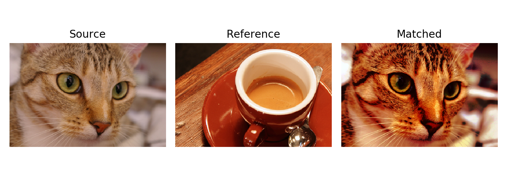

# Histogram matching

Rewrite match_histograms function from skimage.exposure module in Tensorflow.
Aurthor: Yao


## Description
Adjust an image so that its cumulative histogram matches that of another.
The adjustment is applied separately for each channel.

## How it works
For two given images, reference image and target image. The match_cumulative_cdf function will calculate the cumulative distribution and probability distribution of reference image. Devide two images into many bins. Use interpolation funtion to match two images by their corresponding bins. Use ths probability distribution of reference to redraw the target image.

## Example 
This example demonstrates the feature of histogram matching. It manipulates the pixels of an input image so that its histogram matches the histogram of the reference image. If the images have multiple channels, the matching is done independently for each channel, as long as the number of channels is equal in the input image and the reference.

```python
image = tf.convert_to_tensor(data.chelsea())
reference = tf.convert_to_tensor(data.coffee())
matched = mh.match_histograms(image, reference, multichannel=True)
fig, (ax1, ax2, ax3) = plt.subplots(nrows=1, ncols=3, figsize=(8, 3),
                                    sharex=True, sharey=True)
for aa in (ax1, ax2, ax3):
        aa.set_axis_off()
ax1.imshow(image1)
ax1.set_title('Source')
ax2.imshow(image2)
ax2.set_title('Reference')
ax3.imshow(matched)
ax3.set_title('Matched')
plt.tight_layout()
plt.show()
```



## Dependencies
Tensorflow verison: 2.0
